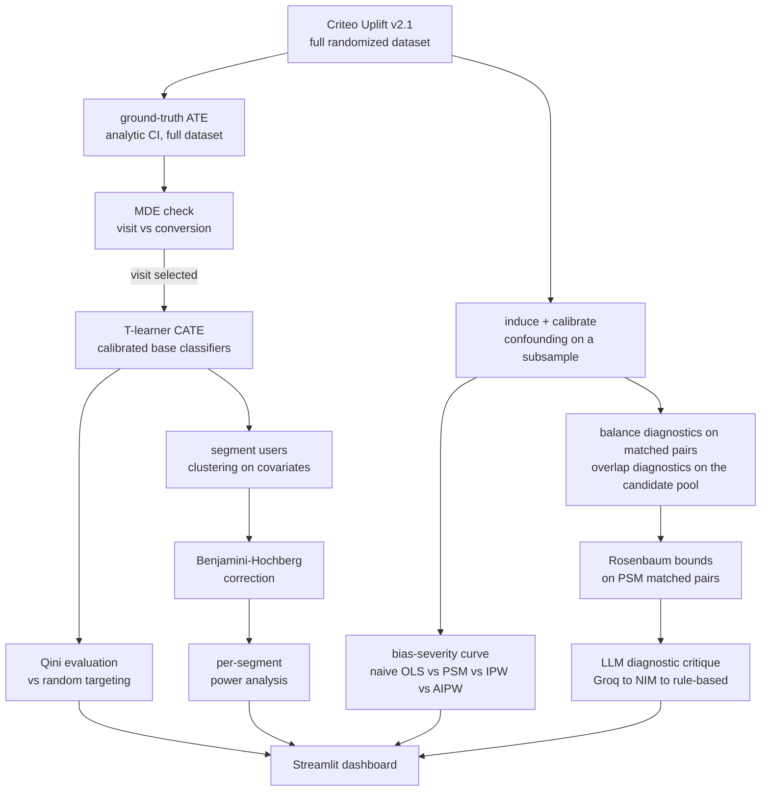

# Causal Impact & Heterogeneous Response Analysis

A causal inference pipeline that turns randomized ad-exposure data into two validated answers: overall impact and which audiences actually responded, with each estimator benchmarked against known ground truth and every segment-level result rigorously tested for statistical significance.

Built as a portfolio project on entirely free-tier infrastructure: no paid APIs, no GPU, no local model weights beyond scikit-learn's own classifiers. Runs end-to-end on a 16GB, no-GPU laptop.

## Preview

<p align="center">
  
  <br>
  <sub>Section 2, Heterogeneity: Third of six pipeline-stage tabs.</sub>
</p>

Additional screenshots (`01_validation`, `01.5_outcome.png`, `02_heterogeneity.png`, `03_rigor.png`, `04_sensitivity.png`, `05_critique.png`) are in [`assets/`](assets/) using that naming convention, one per dashboard tab.

## What this is

Given the Criteo Uplift dataset, the pipeline:

1. **Proves the method works, before trusting it on real data.** Artificially confounds a subsample and checks whether naive OLS, propensity score matching, IPW, and AIPW can recover the known ground-truth effect across a range of confounding severities.
2. **Justifies the outcome variable.** A minimum-detectable-effect calculation, not a default, decides whether `visit` or `conversion` is usable for segment-level analysis.
3. **Finds who responds differently.** Estimates a CATE model on the clean randomized data, evaluates it honestly against random targeting rather than assuming it's correct just because it ran, and segments users to see where the effect actually differs.
4. **Checks whether that finding is statistically defensible.** Corrects for testing many segments at once, and confirms each segment is even large enough to detect the effect being claimed.
5. **Stress-tests the result.** Rosenbaum bounds quantify how much unmeasured confounding would be needed to overturn the matched-pairs conclusion.

## Dataset

**[Criteo Uplift Modeling Dataset, v2.1](https://huggingface.co/datasets/criteo/criteo-uplift)** (Diemert et al., 2018), ~13.9M rows from a real, randomized ad-exposure experiment in a live advertising system. v2.1 adds an `exposure` column on top of `treatment`. No registration or approval process required.

| Column | Type | Description |
|---|---|---|
| `f0`–`f11` | float | 12 anonymized dense covariates |
| `treatment` | binary | 1 = treated, 0 = control |
| `exposure` | binary | effective exposure flag (v2.1 addition) |
| `visit` | binary | base rate ≈ 4–5% |
| `conversion` | binary | base rate ≈ 0.3% |

Loaded via `datasets.load_dataset("criteo/criteo-uplift")` (Hugging Face), with `sklift.datasets.fetch_criteo(target_col='all', treatment_col='all')` as an automatic fallback if Hugging Face is unreachable. An integrity check runs immediately after load, row count, column names, and treatment/control split ratio are all checked against documented values, and the load **fails loudly** on drift rather than silently continuing.

### Why `visit`, not `conversion`

Before any segment-level work begins, a minimum detectable effect (MDE) calculation (`statsmodels.stats.power.NormalIndPower`) checks what effect size each outcome can actually detect at the planned subsample size:

| Outcome | Baseline rate | Relative MDE at n=100k/arm |
|---|---|---|
| `visit` | ~4.5% | ~5.9% |
| `conversion` | ~0.3% | ~24.1% |

`conversion`'s rarity means it can't support reliable per-segment estimation at CPU-feasible sample sizes. Consequence: **`visit` is the outcome for Sections 2 and 3.** `conversion` is used only for the full-dataset ground-truth ATE in Section 1, where n is large enough to be meaningful, and is explicitly excluded from segment-level work, this table is why, not an afterthought.

## Pipeline



- ### Section 1: Validation via self-induced confounding

Ground-truth ATE is computed analytically from the full randomized dataset; bootstrapping ~13.9M rows adds cost without meaningful benefit.

Confounding is induced via:

```text
retention_probability = sigmoid(g0 + g1·X + g2·X·T)
```

`X` is selected for outcome correlation so the interaction can create genuine confounding. A calibration loop increases `g2` until both treatment imbalance and naive-estimate bias are detected, with a capped `max_iters` and explicit `converged: False` on failure.

Naive OLS, PSM, IPW, and AIPW are compared across four confounding severities, producing a bias-severity curve. Each estimate has a real bootstrap CI. PSM is strict 1:1 without replacement, so the ~85/15 treatment/control split naturally leaves many treated units unmatched; match rate and balance are reported.

- ### Section 1.5: Outcome selection

Before segment-level work begins, an MDE calculation decides whether `visit` or `conversion` can support reliable per-segment estimation at CPU-feasible sample sizes; see [Why `visit`, not `conversion`](#why-visit-not-conversion) for the full table. `visit` is selected for Sections 2 and 3; `conversion` is used only for the Section 1 ground-truth ATE.

- ### Section 2: Heterogeneity

A calibrated **T-learner** estimates CATE; causal forests are future work. A held-out **Qini coefficient** validates uplift ranking against random targeting.

Users are clustered on pre-treatment covariates, with quantile segmentation as an alternative. Segment treatment effects include bootstrap CIs.

- ### Section 3: Statistical rigor and Corrections

**Benjamini-Hochberg** correction controls multiple testing across segments. Per-segment power analysis checks whether each segment can detect the claimed effect.

Power is anchored to the Section 1 ground-truth ATE, avoiding circularity. If ground truth is unavailable, the segment-effect median is used as an explicitly illustrative fallback.

- ### Section 4: Sensitivity analysis

**Rosenbaum bounds** are applied to the calibrated PSM matched pairs, yielding the critical **Gamma**: the unmeasured-confounding strength needed to overturn the conclusion.

- ### Section 5: The one (and only) LLM step

One diagnostic critique uses balance, overlap, and Rosenbaum outputs to flag likely assumption violations in plain language.

**Groq** is primary, **NVIDIA NIM** is fallback, and a deterministic rule-based fallback is used if both fail. The LLM is not used for reporting, summarization, the README, Sections 2–3, or anywhere else.

## Methods

| Section | Method | Library | Role |
|---|---|---|---|
| 1 | Naive OLS | `statsmodels` | Baseline, no confounder adjustment, expected to be the most biased under confounding |
| 1 | Propensity score matching | `scikit-learn` + `sortedcontainers` | 1:1 without replacement, a real matched-pairs design, not an approximation of one |
| 1 | IPW | `scikit-learn` (propensity model) | Hajek-normalized inverse probability weighting |
| 1 | AIPW | `scikit-learn` (propensity + outcome models) | Doubly robust, consistent if either the propensity or the outcome model is correctly specified |
| 2 | T-learner CATE | `scikit-learn` (calibrated classifiers) | Two per-arm outcome models; their difference gives the estimated CATE |
| 4 | Rosenbaum bounds | `scipy` (`binom`) | Sensitivity of the matched-pairs conclusion to an unmeasured confounder |

## Guardrails

* **Calibration fails loudly:** If the validation gate doesn't pass within `max_iters`, it reports `converged: False` rather than accepting an uncalibrated severity.
* **Matching is true 1:1:** Controls are removed once matched, preventing reuse and inflated match rates.
* **Power analysis flags weak inputs:** If Section 1 hasn't run, the fallback effect size is clearly labeled as less defensible rather than presented as authoritative.
* **Data integrity is enforced:** Row count, columns, and treatment/control split are validated on load; drift stops the pipeline.
* **The LLM cannot change results:** It only interprets existing diagnostics. Estimates, p-values, and bounds are untouched, and an unavailable LLM triggers a deterministic fallback.

## Project Structure
```
causal-impact-lab/
├── data/                          # local dataset cache + generated artifacts (gitignored)
├── assets/                        # dashboard screenshots used in this README
│
├── src/
│   ├── utils/
│   │   ├── data_loader.py         # HF load + sklift fallback + integrity check
│   │   ├── power_analysis.py      # MDE calc, power curves, per-segment power
│   │   ├── bootstrap.py           # stratified bootstrap CI + analytic large-n CI
│   │   ├── db.py                  # Supabase run-logging + local SQLite fallback
│   │   └── logging_config.py      # Logfire-backed structured logging + console fallback
│   │
│   ├── validation/                # Section 1
│   │   ├── confounding.py         # retention rule, calibration loop, dose-response grid
│   │   ├── estimators.py          # naive OLS, PSM, IPW, AIPW, common-support trimming
│   │   └── diagnostics.py         # balance (SMD, love plot), overlap diagnostics
│   │
│   ├── heterogeneity/             # Section 2 + 3
│   │   ├── cate.py                # T-learner (calibrated base classifiers)
│   │   ├── segmentation.py        # clustering / quantile splits, per-segment effects
│   │   └── evaluation.py          # Qini coefficient, Benjamini-Hochberg correction
│   │
│   ├── sensitivity/               # Section 4
│   │   └── rosenbaum.py           # Rosenbaum bounds on PSM matched pairs
│   │
│   └── llm_critique/
│       └── critique.py            # the one bounded LLM diagnostic step
│
├── notebooks/
│   ├── 01_validation.ipynb        # Section 1
│   ├── 02_heterogeneity.ipynb     # Section 2 and 3
│   └── 03_sensitivity.ipynb       # Section 4
│
├── dashboard/app.py               # Streamlit dashboard (reads db.py + data/processed/ artifacts)
├── .streamlit/config.toml         # dashboard's light theme
│
├── tests/
│
├── .env.example
├── .gitignore
├── requirements.txt
└── README.md
```

## Tech stack

| Layer | Choice |
|---|---|
| Compute | Local CPU only, subsampled for CATE/estimator work |
| Core libraries | `pandas`, `numpy`, `scikit-learn`, `statsmodels`, `scipy`, `scikit-uplift`, `sortedcontainers` (1:1 matching without replacement) |
| Database | Supabase (primary), local SQLite (automatic fallback) |
| Logging | Logfire (structured), console (automatic fallback) |
| Dashboard | Streamlit, custom CSS + a pinned `.streamlit/config.toml` theme (no separate stylesheet or build step) |
| LLM | Groq (primary, `openai/gpt-oss-120b`) → NVIDIA NIM (fallback, `mistralai/mistral-nemotron`) → rule-based, free tier |

## Getting started

1. **Install**
   ```bash
   git clone https://github.com/abhinavharbola/causal-impact-lab.git
   cd causal-impact-lab
   python -m venv venv && source venv/bin/activate    # venv\Scripts\activate on Windows
   pip install -r requirements.txt
   cp .env.example .env    # then fill in whichever keys you're using, see table below, all optional
   ```

   > **Known install gotcha (Debian/Ubuntu):** installing `supabase` can fail to upgrade a
   > system-installed `PyJWT` package ("Cannot uninstall PyJWT ... RECORD file not found"). If you
   > hit this, run `pip install supabase --ignore-installed PyJWT`.

2. **API keys**, all optional, everything has a local fallback so the pipeline runs end-to-end with none of them set:

   | Variable | Used by | If unset |
   |---|---|---|
   | `GROQ_API_KEY` | LLM critique (primary) | Falls back to NVIDIA NIM, then to a rule-based critique |
   | `NVIDIA_NIM_API_KEY` | LLM critique (fallback) | Falls back to a rule-based critique |
   | `SUPABASE_URL` / `SUPABASE_KEY` | Run logging | Falls back to a local SQLite file at `data/local_runs.db` |
   | `LOGFIRE_TOKEN` | Structured logging | Falls back to plain console logging |

3. **Database.** No setup required for the local SQLite fallback. If you're using Supabase, the table has to be created manually before running the notebooks, since the app never creates it for you:

   ```sql
   create table estimation_runs (
       id bigint generated always as identity primary key,
       method text not null,
       severity_label text,
       g2 real,
       config text,
       point_estimate real,
       ci_lower real,
       ci_upper real,
       balance_stats text,
       created_at text not null,
       unique (method, severity_label)
   );
   ```

   Run this in the Supabase SQL editor before setting `SUPABASE_URL` / `SUPABASE_KEY`. The `unique (method, severity_label)` constraint is required, it's what makes `log_estimation_run`'s upsert overwrite a rerun of the same method/severity instead of duplicating it.

## Running it

```bash
jupyter notebook
```

Run the three notebooks in order, each is a thin wrapper that calls into `src/`, so the actual logic lives in one tested place, not duplicated across notebook and dashboard:

1. `01_validation.ipynb`, Sections 1 & 1.5. Saves `data/processed/ground_truth.json`, `data/processed/balance_table.csv`, `data/processed/match_diagnostics.json`, and `data/interim/confounded_strong_with_propensity.parquet` (consumed by notebook 3), and logs every estimator run to the database.
2. `02_heterogeneity.ipynb`, Sections 2 & 3. Saves `data/processed/qini_curve.json`, `data/processed/segment_effects.csv`, `data/processed/segment_power.csv`.
3. `03_sensitivity.ipynb`, Section 4. Loads notebook 1's saved artifact, saves `data/processed/rosenbaum_bounds.csv` and `data/processed/critique.json`.

Then view everything together:

```bash
streamlit run dashboard/app.py
```

The dashboard is a visualization layer, not a recomputation engine, it reads the logged runs and saved artifacts above across six tabs (one per pipeline stage, plus the diagnostic critique on its own). If a section's artifact doesn't exist yet, it shows which notebook to run, rather than crashing.

Run the tests with:

```bash
pytest tests/ -v
```

32 tests across `test_confounding.py`, `test_estimators.py`, `test_diagnostics.py`, and `test_power_analysis.py`, covering calibration convergence/non-convergence, estimator correctness on known synthetic data, matched-pairs uniqueness (no control row reused across pairs), and MDE/power calculation correctness.

## Known limitations

- Matching (Sections 1 & 4) is strict 1:1 without replacement; under this dataset's ~85/15 treated/control split that discards most treated units by design. The reported match rate makes this visible in the dashboard rather than hiding it.
- `conversion`'s ~0.3% base rate makes it unusable for segment-level work at CPU-feasible sample sizes (see the MDE table above); it's used only for the full-dataset ground-truth ATE.
- Rosenbaum bounds are defined for matched pairs and are computed only against the PSM estimator; IPW and AIPW have no equivalent sensitivity check in this project.
- The one LLM step depends on free-tier Groq/NVIDIA NIM availability; if both are unreachable, it falls back to a deterministic rule-based critique that is correct but less nuanced than a live LLM response.