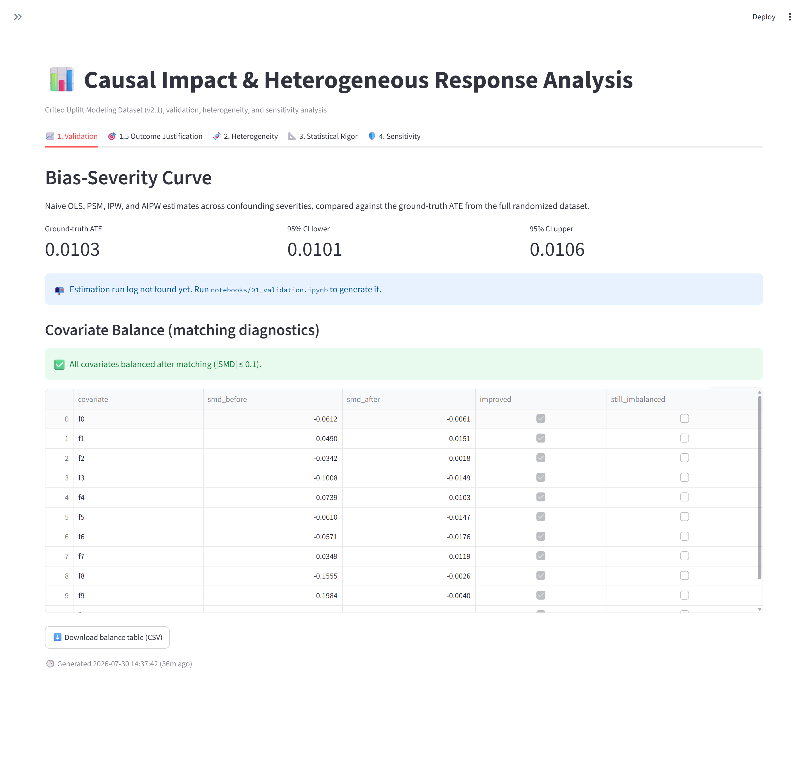
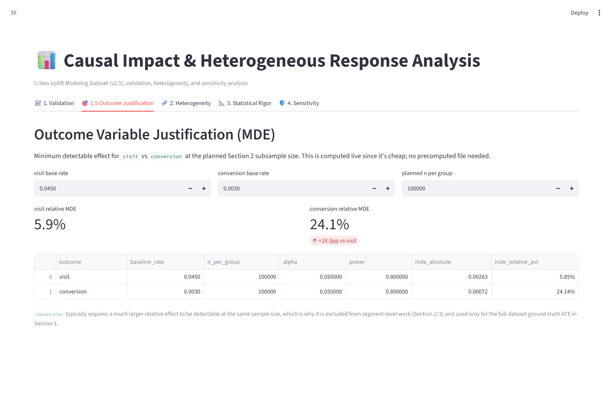
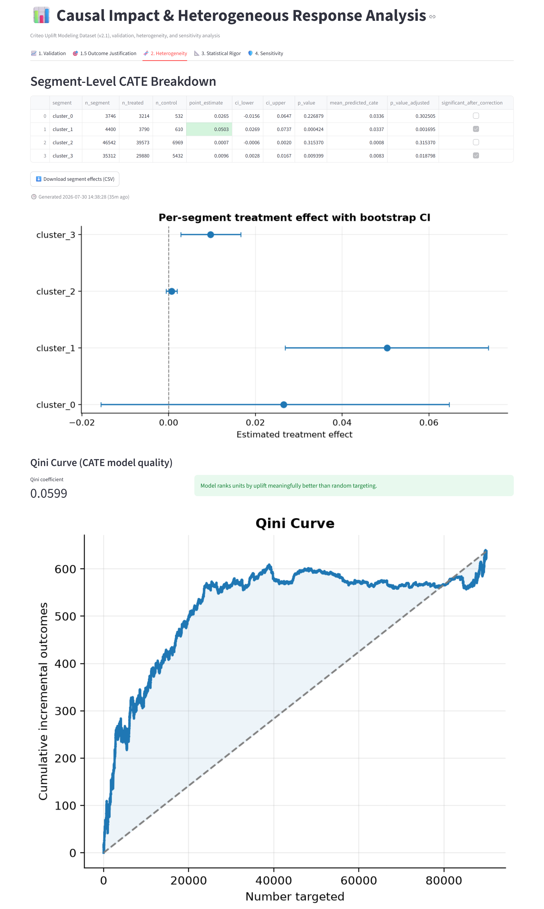
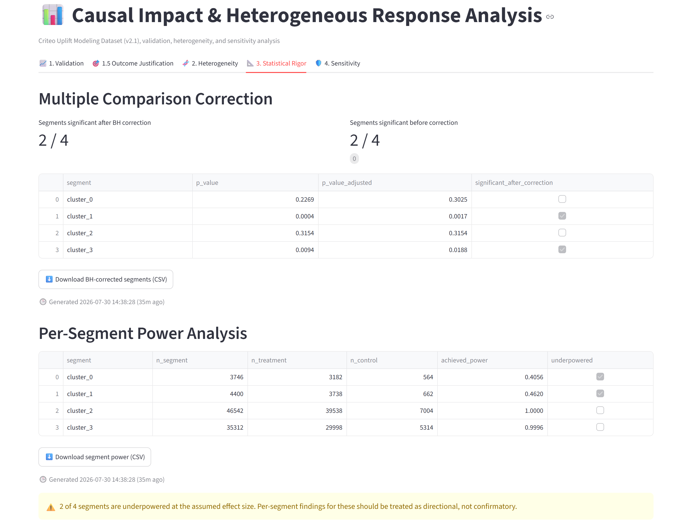
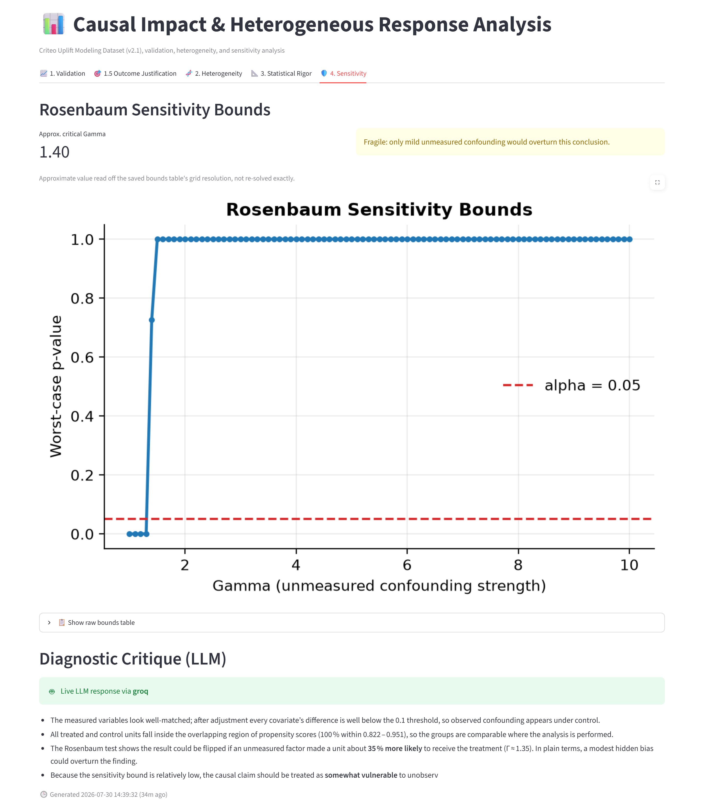

# Causal Impact & Heterogeneous Response Analysis

A causal inference portfolio project built on a single genuinely randomized dataset. It first proves its own estimation pipeline works, by artificially confounding a subsample and checking whether propensity-based methods recover the known truth, then applies that validated pipeline to the full randomized data to estimate the average treatment effect and, more importantly, how that effect varies across user segments.

Runs entirely on a 16GB, no-GPU laptop using free-tier tools throughout.

---

## The narrative

1. **Prove the method works.** Artificially confound a subsample of the randomized data and check whether naive OLS, propensity score matching, IPW, and AIPW recover the known ground-truth effect across a range of confounding severities.
2. **Justify the outcome variable.** A minimum-detectable-effect calculation, not a default, decides whether `visit` or `conversion` is usable for segment-level analysis.
3. **Find who responds differently.** Estimate a CATE model on the clean randomized data, evaluate it honestly (never assume it's correct just because it ran), and segment users to see where the treatment effect actually differs.
4. **Check if that finding is statistically defensible.** Correct for testing many segments at once, and confirm each segment is even large enough to detect the effect being claimed.
5. **Stress-test the result.** Rosenbaum bounds quantify how much unmeasured confounding would be needed to overturn the matched-pairs conclusion.

Every method here serves that narrative. Nothing was added just to check a skill-list box, see [Explicitly Out of Scope](#explicitly-out-of-scope) for what was deliberately left out, and why.

---

## Dashboard Preview

Click any screenshot to view it full size.

<table>
<tr>
<td align="center" width="50%">
<a href="assets/01_validation.png">

</a>
<br><b>1. Validation</b><br>
<sub>Bias-severity curve and covariate balance diagnostics.</sub>
</td>

<td align="center" width="50%">
<a href="assets/05_outcome_justification.png">

</a>
<br><b>1.5. Outcome Justification</b><br>
<sub>Minimum detectable effect comparison.</sub>
</td>
</tr>

<tr>
<td align="center">
<a href="assets/02_heterogeneity.png">

</a>
<br><b>2. Heterogeneity</b><br>
<sub>Segment-level CATE estimates and Qini evaluation.</sub>
</td>

<td align="center">
<a href="assets/03_statistical_rigor.png">

</a>
<br><b>3. Statistical Rigor</b><br>
<sub>Multiple testing correction and power analysis.</sub>
</td>
</tr>

<tr>
<td align="center" colspan="2">
<a href="assets/04_sensitivity.png">

</a>
<br><b>4. Sensitivity Analysis</b><br>
<sub>Rosenbaum bounds and diagnostic critique.</sub>
</td>
</tr>
</table>

---

## Dataset

**[Criteo Uplift Modeling Dataset, v2.1](https://huggingface.co/datasets/criteo/criteo-uplift)** (Diemert et al., 2018), ~13.9M rows from a real, randomized ad-exposure experiment in a live advertising system. v2.1 adds an `exposure` column on top of `treatment`. No registration or approval process required.

| Column | Type | Description |
|---|---|---|
| `f0`–`f11` | float | 12 anonymized dense covariates |
| `treatment` | binary | 1 = treated, 0 = control |
| `exposure` | binary | effective exposure flag (v2.1 addition) |
| `visit` | binary | base rate ≈ 4–5% |
| `conversion` | binary | base rate ≈ 0.3% |

Loaded via `datasets.load_dataset("criteo/criteo-uplift")` (Hugging Face), with `sklift.datasets.fetch_criteo(target_col='all', treatment_col='all')` as an automatic fallback if Hugging Face is unreachable. An integrity check runs immediately after load, row count, column names, and treatment/control split ratio are all checked against documented values, and the load **fails loudly** on drift rather than silently continuing.

### Why `visit`, not `conversion`

Before any segment-level work begins, a minimum detectable effect (MDE) calculation (`statsmodels.stats.power.NormalIndPower`) checks what effect size each outcome can actually detect at the planned subsample size:

| Outcome | Baseline rate | Relative MDE at n=100k/arm |
|---|---|---|
| `visit` | ~4.5% | ~5.9% |
| `conversion` | ~0.3% | ~24.1% |

`conversion`'s rarity means it can't support reliable per-segment estimation at CPU-feasible sample sizes. Consequence: **`visit` is the outcome for Sections 2 and 3.** `conversion` is used only for the full-dataset ground-truth ATE in Section 1, where n is large enough to be meaningful, and is explicitly excluded from segment-level work, this table is why, not an afterthought.

---

## Project structure

```
causal-uplift-project/
├── data/                          # local dataset cache + generated artifacts (gitignored)
│
├── src/
│   ├── utils/
│   │   ├── data_loader.py         # HF load + sklift fallback + integrity check
│   │   ├── power_analysis.py      # MDE calc, power curves, per-segment power
│   │   ├── bootstrap.py           # stratified bootstrap CI + analytic large-n CI
│   │   ├── db.py                  # Supabase run-logging + local SQLite fallback
│   │   └── logging_config.py      # Logfire-backed structured logging + console fallback
│   │
│   ├── validation/                # Section 1
│   │   ├── confounding.py         # retention rule, calibration loop, dose-response grid
│   │   ├── estimators.py          # naive OLS, PSM, IPW, AIPW, common-support trimming
│   │   └── diagnostics.py         # balance (SMD, love plot), overlap diagnostics
│   │
│   ├── heterogeneity/             # Section 2 + 3
│   │   ├── cate.py                # T-learner (calibrated base classifiers)
│   │   ├── segmentation.py        # clustering / quantile splits, per-segment effects
│   │   └── evaluation.py          # Qini coefficient, Benjamini-Hochberg correction
│   │
│   ├── sensitivity/               # Section 4
│   │   └── rosenbaum.py           # Rosenbaum bounds on PSM matched pairs
│   │
│   └── llm_critique/
│       └── critique.py            # the one bounded LLM diagnostic step
│
├── notebooks/
│   ├── 01_validation.ipynb        # Section 1
│   ├── 02_heterogeneity.ipynb     # Section 2 and 3
│   └── 03_sensitivity.ipynb       # Section 4
│
├── dashboard/app.py               # Streamlit dashboard (reads db.py + data/processed/ artifacts)
│
├── tests/
│
├── .env.example
├──.gitignore
├── requirements.txt
└── README.md
```

---

## Pipeline

### Section 1: Validation via self-induced confounding

The ground-truth ATE is computed directly from the full randomized dataset (analytic Wald CI, bootstrapping ~13.9M rows would cost real compute for no statistical gain at that sample size).

Confounding is induced with a parameterized retention rule, not by dropping units on an outcome-correlated covariate alone (which doesn't reliably bias a treatment effect estimate in already-randomized data):

```
retention_probability = sigmoid(g0 + g1·X + g2·X·T)
```

`X` is selected by correlation with the outcome, not arbitrarily, an outcome-irrelevant `X` would let `g2` grow indefinitely without ever biasing the naive estimate, since the whole point of the interaction term is that it only creates real confounding when `X` actually predicts the outcome.

A **calibration loop** increases `g2` until a two-part validation gate passes: (a) `corr(X, T)` is significantly nonzero in the retained sample, and (b) the naive difference-in-means estimate falls outside the ground-truth CI. The loop is capped at `max_iters` and reports `converged: False` explicitly if the gate never trips, rather than looping forever or silently accepting an uncalibrated severity.

The full estimator comparison, naive OLS, propensity score matching (with balance diagnostics), IPW, and AIPW, runs across four severities (none / mild / moderate / strong), producing the project's central diagnostic: a **bias-severity curve** showing naive estimation break down while matching/weighting stay comparatively robust. Each point on that curve carries a real bootstrap confidence interval (`run_estimator_comparison_with_ci`), not a fixed-width heuristic, computed without refitting AIPW's nuisance models on every resample (see the function's docstring for how).

Matching (`get_matched_pairs`) is strict 1:1 without replacement: every control row is used in at most one pair. Under this dataset's ~85/15 treated/control split, that caps the number of matched pairs at the size of the control group, so most treated units go unmatched — expected behavior for a genuine matched-pairs design, not a bug, and reported explicitly as a match rate alongside the balance table.

### Section 2: Heterogeneity

A **T-learner** is the primary CATE method, simpler and more defensible to explain than a causal forest, which is documented as a future extension rather than built (see below). Base classifiers are calibrated (`CalibratedClassifierCV`), since `visit`'s low base rate makes uncalibrated probability estimates noisy in exactly the way that gets amplified by taking a difference of two of them.

The T-learner's output is never assumed correct just because it ran, a **Qini coefficient** against a held-out split quantifies whether it actually ranks units by uplift better than random targeting.

Users are segmented via unsupervised clustering on pre-treatment covariates (Criteo's covariates are anonymized floats, not literal recency/frequency/value fields, so clustering is the natural default; a business-style quantile split is available as a simpler alternative). Per-segment treatment effects are estimated with bootstrap confidence intervals.

### Section 3: Statistical rigor

Testing many segments at once inflates the false-positive rate, so **Benjamini-Hochberg correction** is applied before any segment is called significant. A **per-segment power analysis** separately checks whether each segment is even large enough to detect the effect size being claimed, a common real-world mistake this project deliberately surfaces rather than glosses over.

The power analysis anchors its assumed effect size on Section 1's ground-truth ATE (loaded from `data/processed/ground_truth.json`) rather than on the segment effects computed earlier in the same notebook, using the same effects to set the target and then to test against it is circular and overstates how informative the power numbers are. If `01_validation.ipynb` hasn't been run yet, the notebook falls back to the segment-effect median and says so explicitly, flagging that fallback as illustrative only.

### Section 4: Sensitivity analysis

**Rosenbaum bounds** run specifically on the PSM matched-pairs output from Section 1, at the calibrated confounding severity, not on IPW/AIPW estimates, since Rosenbaum bounds are defined in terms of matched pairs and there's no equivalent structure for a weighting-based estimator. The output is the critical Gamma: how strong an unmeasured confounder would need to be, in odds-ratio terms, to overturn the matched-pairs conclusion.

### The one LLM step

A single diagnostic critique reads the balance table, overlap diagnostics, and Rosenbaum sensitivity output, and produces a short plain-language flag of likely assumption violations for a non-technical stakeholder. **Groq is the primary provider, NVIDIA NIM the fallback** (both free tier, both serving `openai/gpt-oss-120b`), with a deterministic rule-based fallback if neither is reachable. This is a small, clearly bounded diagnostic utility, it does not generate narrative reports, does not summarize the project, does not write this README, and is not used anywhere in Sections 2 or 3. Nothing else in this project calls an LLM.

---

## Explicitly Out of Scope

Left out deliberately, not for lack of time:

- **Causal forests / X-learner / DR-learner.** A T-learner is simpler to explain and debug, and is defensible here specifically because `visit`'s base rate and the calibrated base classifiers keep its per-arm outcome models well-behaved. A causal forest would likely give tighter CATE estimates at the cost of being harder to reason about and slower to iterate on for a portfolio project, worth revisiting if this were a production system rather than a demonstration of the validation methodology.
- **Instrumental variables / regression discontinuity.** The dataset is already a genuine randomized experiment, so there's no compliance or assignment-mechanism problem to instrument around. Including an IV section would be checking a skill-list box, not serving the narrative.
- **Multiple treatment arms / dose-response on the real treatment.** Criteo's `treatment` column is binary. The dose-response curve in Section 1 varies simulated confounding severity, not the real treatment itself — there is no real multi-arm structure in this data to model.
- **Long-term / delayed outcome windows.** `visit` and `conversion` are both measured within the dataset's fixed attribution window; there's no timestamp granularity in this release to study effect decay or delayed conversion.
- **Off-policy evaluation of a new targeting policy.** The CATE model here is evaluated for ranking quality (Qini) against the existing random assignment, not used to simulate or score a hypothetical new targeting policy, that's a natural next step but a different (and larger) validation problem.
- **GPU / deep-learning uplift models.** Runs on a 16GB no-GPU laptop by design; a two-model T-learner with calibrated linear/logistic base learners is enough to demonstrate the validation methodology without needing a GPU-backed uplift network.
- **Variable-ratio or with-replacement PSM.** Matching here is strict 1:1 without replacement (see Section 1), which under this dataset's ~85/15 split discards most treated units. Variable-ratio matching (k controls per treated unit) or full/optimal matching would use the data more efficiently and is a reasonable extension, left out to keep the matched-pairs structure that Section 4's Rosenbaum bounds are defined in terms of as simple as possible to reason about.

---

## Tech stack

| Layer | Choice |
|---|---|
| Compute | Local CPU only, subsampled for CATE/estimator work |
| Core libraries | `pandas`, `numpy`, `scikit-learn`, `statsmodels`, `scipy`, `scikit-uplift`, `sortedcontainers` (1:1 matching without replacement) |
| Database | Supabase (primary), local SQLite (automatic fallback) |
| Logging | Logfire (structured), console (automatic fallback) |
| Dashboard | Streamlit |
| LLM | Groq (primary) → NVIDIA NIM (fallback), both serving `openai/gpt-oss-120b`, free tier |

---

## Setup

```bash
git clone https://github.com/abhinavharbola/causal-impact-lab.git
cd causal-uplift-project
python -m venv venv
source venv/bin/activate        # venv\Scripts\activate on Windows
pip install -r requirements.txt
cp .env.example .env            # then fill in whichever keys you're using (all optional)
```

> **Known install gotcha (Debian/Ubuntu):** installing `supabase` can fail to upgrade a
> system-installed `PyJWT` package ("Cannot uninstall PyJWT ... RECORD file not found"). If you
> hit this, run `pip install supabase --ignore-installed PyJWT`.

### Environment variables (all optional, everything has a local fallback)

| Variable | Used by | If unset |
|---|---|---|
| `GROQ_API_KEY` | LLM critique (primary) | Falls back to NVIDIA NIM, then to a rule-based critique |
| `NVIDIA_NIM_API_KEY` | LLM critique (fallback) | Falls back to a rule-based critique |
| `SUPABASE_URL` / `SUPABASE_KEY` | Run logging | Falls back to a local SQLite file at `data/local_runs.db` |
| `LOGFIRE_TOKEN` | Structured logging | Falls back to plain console logging |

## Running the pipeline

```bash
jupyter notebook
```

Run the three notebooks in order, each is a thin wrapper that calls into `src/`, so the actual logic lives in one tested place, not duplicated across notebook and dashboard:

1. `01_validation.ipynb`, Sections 1 & 1.5. Saves `data/processed/ground_truth.json`, `data/processed/balance_table.csv`, and `data/interim/confounded_strong_with_propensity.parquet` (consumed by notebook 3), and logs every estimator run to the database.
2. `02_heterogeneity.ipynb`, Sections 2 & 3. Saves `data/processed/qini_curve.json`, `data/processed/segment_effects.csv`, `data/processed/segment_power.csv`.
3. `03_sensitivity.ipynb`, Section 4. Loads notebook 1's saved artifact, saves `data/processed/rosenbaum_bounds.csv` and `data/processed/critique.json`.

Then view everything together:

```bash
streamlit run dashboard/app.py
```

The dashboard is a visualization layer, not a recomputation engine, it reads the logged runs and saved artifacts above. If a section's artifact doesn't exist yet, it shows which notebook to run, rather than crashing.

Styling is entirely CSS injected in `dashboard/app.py` (no separate stylesheet or build step): Source Serif 4 for headings, Public Sans for body/UI text, IBM Plex Mono for anything numeric (estimates, p-values, gamma), loaded via a Google Fonts `@import` so nothing needs to be installed locally. Every chart, badge, and table uses the same token palette, a cool-neutral paper background, deep ink-blue for structure, a restrained gold accent for the handful of signal moments (active tab, key emphasis), and one consistent set of method colors across every method comparison in the app, rather than mixing per-chart defaults.

## Running the tests

```bash
pytest tests/ -v
```

32 tests across `test_confounding.py`, `test_estimators.py`, `test_diagnostics.py`, and `test_power_analysis.py`, covering calibration convergence/non-convergence, estimator correctness on known synthetic data, matched-pairs uniqueness (no control row reused across pairs), and MDE/power calculation correctness.