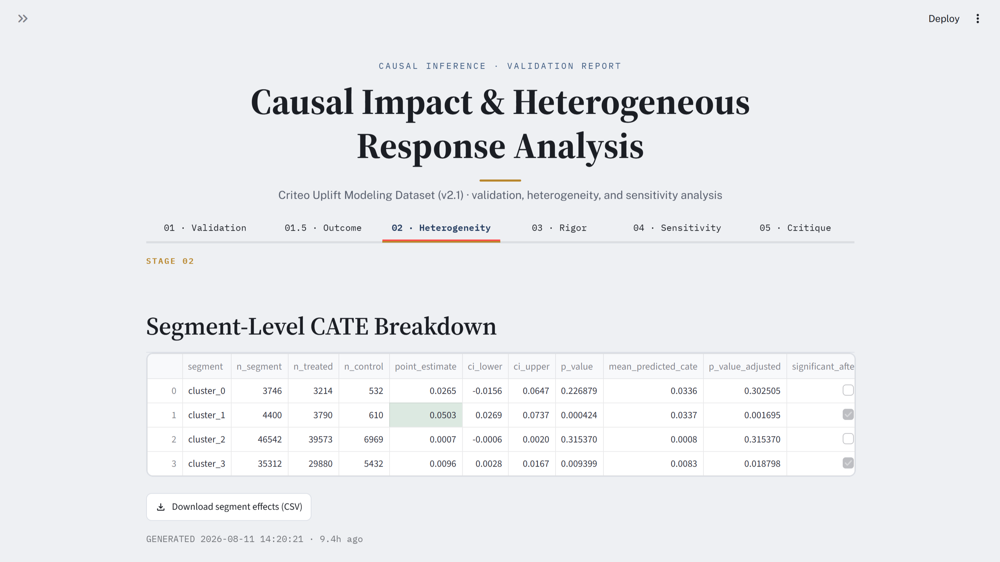
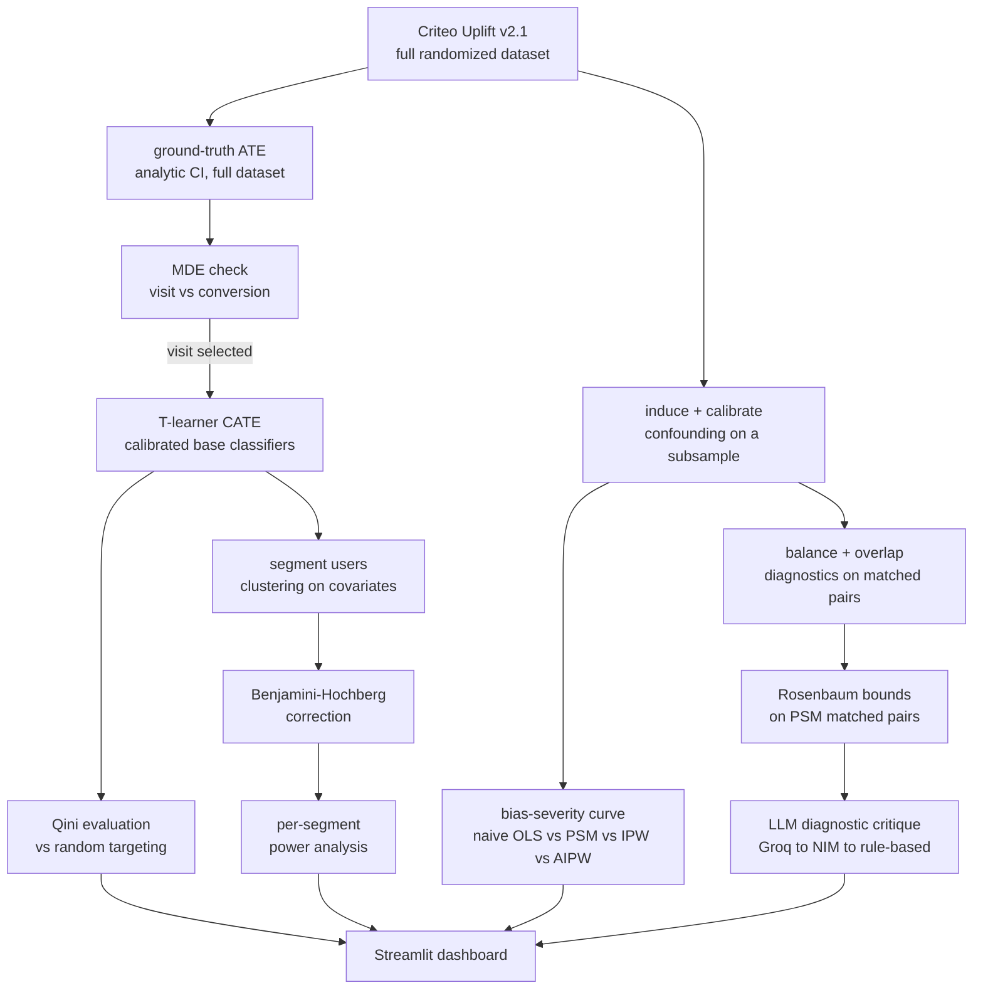

# Causal Impact & Heterogeneous Response Analysis

A causal inference pipeline that takes a randomized ad-exposure dataset and files a validated answer to two questions: what was the average effect, and who did it actually work on, with every estimator checked against a known ground truth before it's trusted, and every segment-level claim checked for statistical validity before it's reported.

Built as a portfolio project on entirely free-tier infrastructure: no paid APIs, no GPU, no local model weights, just scikit-learn's own classifiers. Runs end-to-end on a 16GB, no-GPU laptop.

## Preview

<p align="center">
  
  <br>
  <sub><em>Section 1, Validation: the ground-truth ATE and its confidence interval, the first of six pipeline-stage tabs.</em></sub>
</p>

Additional screenshots (`01_validation`, `01.5_outcome.png`, `02_heterogeneity.png`, `03_rigor.png`, `04_sensitivity.png`, `05_critique.png`) are in [`assets/`](assets/) using that naming convention, one per dashboard tab.

## What this is

Given the Criteo Uplift dataset, the pipeline:

1. **Proves the method works, before trusting it on real data.** Artificially confounds a subsample and checks whether naive OLS, propensity score matching, IPW, and AIPW can recover the known ground-truth effect across a range of confounding severities.
2. **Justifies the outcome variable.** A minimum-detectable-effect calculation, not a default, decides whether `visit` or `conversion` is usable for segment-level analysis.
3. **Finds who responds differently.** Estimates a CATE model on the clean randomized data, evaluates it honestly against random targeting rather than assuming it's correct just because it ran, and segments users to see where the effect actually differs.
4. **Checks whether that finding is statistically defensible.** Corrects for testing many segments at once, and confirms each segment is even large enough to detect the effect being claimed.
5. **Stress-tests the result.** Rosenbaum bounds quantify how much unmeasured confounding would be needed to overturn the matched-pairs conclusion.

## Dataset

**[Criteo Uplift Modeling Dataset, v2.1](https://huggingface.co/datasets/criteo/criteo-uplift)** (Diemert et al., 2018), ~13.9M rows from a real, randomized ad-exposure experiment in a live advertising system. v2.1 adds an `exposure` column on top of `treatment`. No registration or approval process required.

| Column | Type | Description |
|---|---|---|
| `f0`–`f11` | float | 12 anonymized dense covariates |
| `treatment` | binary | 1 = treated, 0 = control |
| `exposure` | binary | effective exposure flag (v2.1 addition) |
| `visit` | binary | base rate ≈ 4–5% |
| `conversion` | binary | base rate ≈ 0.3% |

Loaded via `datasets.load_dataset("criteo/criteo-uplift")` (Hugging Face), with `sklift.datasets.fetch_criteo(target_col='all', treatment_col='all')` as an automatic fallback if Hugging Face is unreachable. An integrity check runs immediately after load, row count, column names, and treatment/control split ratio are all checked against documented values, and the load **fails loudly** on drift rather than silently continuing.

### Why `visit`, not `conversion`

Before any segment-level work begins, a minimum detectable effect (MDE) calculation (`statsmodels.stats.power.NormalIndPower`) checks what effect size each outcome can actually detect at the planned subsample size:

| Outcome | Baseline rate | Relative MDE at n=100k/arm |
|---|---|---|
| `visit` | ~4.5% | ~5.9% |
| `conversion` | ~0.3% | ~24.1% |

`conversion`'s rarity means it can't support reliable per-segment estimation at CPU-feasible sample sizes. Consequence: **`visit` is the outcome for Sections 2 and 3.** `conversion` is used only for the full-dataset ground-truth ATE in Section 1, where n is large enough to be meaningful, and is explicitly excluded from segment-level work, this table is why, not an afterthought.

## Pipeline



### Section 1: Validation via self-induced confounding

The ground-truth ATE is computed directly from the full randomized dataset (analytic Wald CI, bootstrapping ~13.9M rows would cost real compute for no statistical gain at that sample size).

Confounding is induced with a parameterized retention rule, not by dropping units on an outcome-correlated covariate alone (which doesn't reliably bias a treatment effect estimate in already-randomized data):

```
retention_probability = sigmoid(g0 + g1·X + g2·X·T)
```

`X` is selected by correlation with the outcome, not arbitrarily, an outcome-irrelevant `X` would let `g2` grow indefinitely without ever biasing the naive estimate, since the whole point of the interaction term is that it only creates real confounding when `X` actually predicts the outcome.

A **calibration loop** increases `g2` until a two-part validation gate passes: (a) `corr(X, T)` is significantly nonzero in the retained sample, and (b) the naive difference-in-means estimate falls outside the ground-truth CI. The loop is capped at `max_iters` and reports `converged: False` explicitly if the gate never trips, rather than looping forever or silently accepting an uncalibrated severity.

The full estimator comparison, naive OLS, propensity score matching (with balance diagnostics), IPW, and AIPW, runs across four severities (none / mild / moderate / strong), producing the project's central diagnostic: a **bias-severity curve** showing naive estimation break down while matching/weighting stay comparatively robust. Each point on that curve carries a real bootstrap confidence interval (`run_estimator_comparison_with_ci`), not a fixed-width heuristic, computed without refitting AIPW's nuisance models on every resample (see the function's docstring for how).

Matching (`get_matched_pairs`) is strict 1:1 without replacement: every control row is used in at most one pair. Under this dataset's ~85/15 treated/control split, that caps the number of matched pairs at the size of the control group, so most treated units go unmatched — expected behavior for a genuine matched-pairs design, not a bug, and reported explicitly as a match rate alongside the balance table.

### Section 2: Heterogeneity

A **T-learner** is the primary CATE method, simpler and more defensible to explain than a causal forest, which is documented as a future extension rather than built (see below). Base classifiers are calibrated (`CalibratedClassifierCV`), since `visit`'s low base rate makes uncalibrated probability estimates noisy in exactly the way that gets amplified by taking a difference of two of them.

The T-learner's output is never assumed correct just because it ran, a **Qini coefficient** against a held-out split quantifies whether it actually ranks units by uplift better than random targeting.

Users are segmented via unsupervised clustering on pre-treatment covariates (Criteo's covariates are anonymized floats, not literal recency/frequency/value fields, so clustering is the natural default; a business-style quantile split is available as a simpler alternative). Per-segment treatment effects are estimated with bootstrap confidence intervals.

### Section 3: Statistical rigor

Testing many segments at once inflates the false-positive rate, so **Benjamini-Hochberg correction** is applied before any segment is called significant. A **per-segment power analysis** separately checks whether each segment is even large enough to detect the effect size being claimed, a common real-world mistake this project deliberately surfaces rather than glosses over.

The power analysis anchors its assumed effect size on Section 1's ground-truth ATE (loaded from `data/processed/ground_truth.json`) rather than on the segment effects computed earlier in the same notebook, using the same effects to set the target and then to test against it is circular and overstates how informative the power numbers are. If `01_validation.ipynb` hasn't been run yet, the notebook falls back to the segment-effect median and says so explicitly, flagging that fallback as illustrative only.

### Section 4: Sensitivity analysis

**Rosenbaum bounds** run specifically on the PSM matched-pairs output from Section 1, at the calibrated confounding severity, not on IPW/AIPW estimates, since Rosenbaum bounds are defined in terms of matched pairs and there's no equivalent structure for a weighting-based estimator. The output is the critical Gamma: how strong an unmeasured confounder would need to be, in odds-ratio terms, to overturn the matched-pairs conclusion.

### Section 5: The one LLM step

A single diagnostic critique reads the balance table, overlap diagnostics, and Rosenbaum sensitivity output, and produces a short plain-language flag of likely assumption violations for a non-technical stakeholder. **Groq is the primary provider, NVIDIA NIM the fallback** (both free tier, both serving `openai/gpt-oss-120b`), with a deterministic rule-based fallback if neither is reachable. This is a small, clearly bounded diagnostic utility, it does not generate narrative reports, does not summarize the project, does not write this README, and is not used anywhere in Sections 2 or 3. Nothing else in this project calls an LLM.

## Methods

| Section | Method | Library | Role |
|---|---|---|---|
| 1 | Naive OLS | `statsmodels` | Baseline, no confounder adjustment, expected to be the most biased under confounding |
| 1 | Propensity score matching | `scikit-learn` + `sortedcontainers` | 1:1 without replacement, a real matched-pairs design, not an approximation of one |
| 1 | IPW | `scikit-learn` (propensity model) | Hajek-normalized inverse probability weighting |
| 1 | AIPW | `scikit-learn` (propensity + outcome models) | Doubly robust, consistent if either the propensity or the outcome model is correctly specified |
| 2 | T-learner CATE | `scikit-learn` (calibrated classifiers) | Two per-arm outcome models; their difference gives the estimated CATE |
| 4 | Rosenbaum bounds | `scipy` (`binom`) | Sensitivity of the matched-pairs conclusion to an unmeasured confounder |

## Guardrails

- **Calibration never silently succeeds.** If the two-part validation gate (correlation + naive estimate outside CI) never trips within `max_iters`, the loop reports `converged: False` explicitly rather than looping forever or accepting an uncalibrated severity.
- **Matching is strict 1:1, never reused.** `get_matched_pairs` removes a control from the pool the moment it's matched; a reported match rate reflects real 1:1 correspondence, not one inflated by reusing the same control across many pairs.
- **Power analysis flags its own weakest link.** If Section 1 hasn't been run yet, Section 3's per-segment power analysis falls back to a post-hoc, less-defensible effect-size estimate, and prints a warning saying so, rather than quietly reporting a number that looks equally authoritative either way.
- **Data integrity fails loudly, not silently.** Row count, columns, and treatment/control split are checked against documented values immediately after load, and the pipeline stops rather than continuing on drifted data.
- **The LLM step never touches a number.** The diagnostic critique reads already-computed diagnostics and narrates them in plain language; it cannot alter an estimate, a p-value, or a bound, and if it's unreachable the pipeline degrades to a deterministic rule-based critique rather than skipping the step outright.

## Project Structure
```
causal-impact-lab/
├── data/                          # local dataset cache + generated artifacts (gitignored)
├── assets/                        # dashboard screenshots used in this README
│
├── src/
│   ├── utils/
│   │   ├── data_loader.py         # HF load + sklift fallback + integrity check
│   │   ├── power_analysis.py      # MDE calc, power curves, per-segment power
│   │   ├── bootstrap.py           # stratified bootstrap CI + analytic large-n CI
│   │   ├── db.py                  # Supabase run-logging + local SQLite fallback
│   │   └── logging_config.py      # Logfire-backed structured logging + console fallback
│   │
│   ├── validation/                # Section 1
│   │   ├── confounding.py         # retention rule, calibration loop, dose-response grid
│   │   ├── estimators.py          # naive OLS, PSM, IPW, AIPW, common-support trimming
│   │   └── diagnostics.py         # balance (SMD, love plot), overlap diagnostics
│   │
│   ├── heterogeneity/             # Section 2 + 3
│   │   ├── cate.py                # T-learner (calibrated base classifiers)
│   │   ├── segmentation.py        # clustering / quantile splits, per-segment effects
│   │   └── evaluation.py          # Qini coefficient, Benjamini-Hochberg correction
│   │
│   ├── sensitivity/               # Section 4
│   │   └── rosenbaum.py           # Rosenbaum bounds on PSM matched pairs
│   │
│   └── llm_critique/
│       └── critique.py            # the one bounded LLM diagnostic step
│
├── notebooks/
│   ├── 01_validation.ipynb        # Section 1
│   ├── 02_heterogeneity.ipynb     # Section 2 and 3
│   └── 03_sensitivity.ipynb       # Section 4
│
├── dashboard/app.py               # Streamlit dashboard (reads db.py + data/processed/ artifacts)
├── tests/
│
├── .env.example
├── .gitignore
├── requirements.txt
└── README.md
```

## Tech stack

| Layer | Choice |
|---|---|
| Compute | Local CPU only, subsampled for CATE/estimator work |
| Core libraries | `pandas`, `numpy`, `scikit-learn`, `statsmodels`, `scipy`, `scikit-uplift`, `sortedcontainers` (1:1 matching without replacement) |
| Database | Supabase (primary), local SQLite (automatic fallback) |
| Logging | Logfire (structured), console (automatic fallback) |
| Dashboard | Streamlit, custom CSS (no separate stylesheet or build step) |
| LLM | Groq (primary) → NVIDIA NIM (fallback), both serving `openai/gpt-oss-120b`, free tier |

## Getting started

1. **Install**
   ```bash
   git clone https://github.com/abhinavharbola/causal-impact-lab.git
   cd causal-impact-lab
   python -m venv venv && source venv/bin/activate    # venv\Scripts\activate on Windows
   pip install -r requirements.txt
   cp .env.example .env    # then fill in whichever keys you're using, see table below, all optional
   ```

   > **Known install gotcha (Debian/Ubuntu):** installing `supabase` can fail to upgrade a
   > system-installed `PyJWT` package ("Cannot uninstall PyJWT ... RECORD file not found"). If you
   > hit this, run `pip install supabase --ignore-installed PyJWT`.

2. **API keys**, all optional, everything has a local fallback so the pipeline runs end-to-end with none of them set:

   | Variable | Used by | If unset |
   |---|---|---|
   | `GROQ_API_KEY` | LLM critique (primary) | Falls back to NVIDIA NIM, then to a rule-based critique |
   | `NVIDIA_NIM_API_KEY` | LLM critique (fallback) | Falls back to a rule-based critique |
   | `SUPABASE_URL` / `SUPABASE_KEY` | Run logging | Falls back to a local SQLite file at `data/local_runs.db` |
   | `LOGFIRE_TOKEN` | Structured logging | Falls back to plain console logging |

3. **Database**, no setup required by default. Supabase is used automatically if the two variables above are set; otherwise every run logs to a local SQLite file with no configuration needed.

## Running it

```bash
jupyter notebook
```

Run the three notebooks in order, each is a thin wrapper that calls into `src/`, so the actual logic lives in one tested place, not duplicated across notebook and dashboard:

1. `01_validation.ipynb`, Sections 1 & 1.5. Saves `data/processed/ground_truth.json`, `data/processed/balance_table.csv`, `data/processed/match_diagnostics.json`, and `data/interim/confounded_strong_with_propensity.parquet` (consumed by notebook 3), and logs every estimator run to the database.
2. `02_heterogeneity.ipynb`, Sections 2 & 3. Saves `data/processed/qini_curve.json`, `data/processed/segment_effects.csv`, `data/processed/segment_power.csv`.
3. `03_sensitivity.ipynb`, Section 4. Loads notebook 1's saved artifact, saves `data/processed/rosenbaum_bounds.csv` and `data/processed/critique.json`.

Then view everything together:

```bash
streamlit run dashboard/app.py
```

The dashboard is a visualization layer, not a recomputation engine, it reads the logged runs and saved artifacts above across six tabs (one per pipeline stage, plus the diagnostic critique on its own). If a section's artifact doesn't exist yet, it shows which notebook to run, rather than crashing.

Run the tests with:

```bash
pytest tests/ -v
```

32 tests across `test_confounding.py`, `test_estimators.py`, `test_diagnostics.py`, and `test_power_analysis.py`, covering calibration convergence/non-convergence, estimator correctness on known synthetic data, matched-pairs uniqueness (no control row reused across pairs), and MDE/power calculation correctness.

## Known limitations

- Matching (Sections 1 & 4) is strict 1:1 without replacement; under this dataset's ~85/15 treated/control split that discards most treated units by design (see [Explicitly Out of Scope](#explicitly-out-of-scope)). The reported match rate makes this visible in the dashboard rather than hiding it.
- `conversion`'s ~0.3% base rate makes it unusable for segment-level work at CPU-feasible sample sizes (see the MDE table above); it's used only for the full-dataset ground-truth ATE.
- Rosenbaum bounds are defined for matched pairs and are computed only against the PSM estimator; IPW and AIPW have no equivalent sensitivity check in this project.
- The one LLM step depends on free-tier Groq/NVIDIA NIM availability; if both are unreachable, it falls back to a deterministic rule-based critique that is correct but less nuanced than a live LLM response.