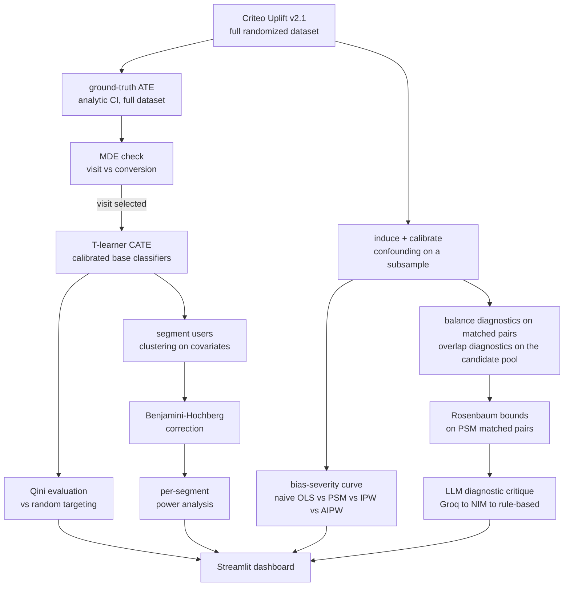

# Causal Impact & Heterogeneous Response Analysis

A causal inference pipeline that turns randomized ad-exposure data into two validated answers: overall impact, and which audiences actually responded, with each estimator benchmarked against known ground truth and every segment-level result rigorously tested for statistical significance.

Built as a portfolio project on entirely free-tier infrastructure: no paid APIs, no GPU, no local model weights beyond scikit-learn's own classifiers. Runs end-to-end on a 16GB, no-GPU laptop.

## Preview

<p align="center">
  
  <br>
  <sub>Section 2, Heterogeneity: Third of six pipeline-stage tabs.</sub>
</p>

> Additional screenshots in [`assets/`](assets/), one for each dashboard tab.

## What this is

Given the Criteo Uplift dataset, the pipeline:

1. **Proves the method works, before trusting it on real data.** Artificially confounds a subsample and checks whether naive OLS, propensity score matching, IPW, and AIPW can recover the known ground-truth effect across a range of confounding severities.
2. **Justifies the outcome variable.** A minimum-detectable-effect calculation, not a default, decides whether `visit` or `conversion` is usable for segment-level analysis.
3. **Finds who responds differently.** Estimates a CATE model on the clean randomized data, evaluates it honestly against random targeting rather than assuming it's correct just because it ran, and segments users to see where the effect actually differs.
4. **Checks whether that finding is statistically defensible.** Corrects for testing many segments at once, and confirms each segment is even large enough to detect the effect being claimed.
5. **Stress-tests the result.** Rosenbaum bounds quantify how much unmeasured confounding would be needed to overturn the matched-pairs conclusion.

## Dataset

**[Criteo Uplift Modeling Dataset, v2.1](https://huggingface.co/datasets/criteo/criteo-uplift)** (Diemert et al., 2018), 13,979,592 rows from a real, randomized ad-exposure experiment in a live advertising system. v2.1 adds an `exposure` column on top of `treatment`. No registration or approval process required.

| Column | Type | Description |
|---|---|---|
| `f0`–`f11` | float | 12 anonymized dense covariates |
| `treatment` | binary | 1 = treated, 0 = control |
| `exposure` | binary | effective exposure flag (v2.1 addition) |
| `visit` | binary | base rate 4.70% |
| `conversion` | binary | base rate 0.29% |

Loaded via `datasets.load_dataset("criteo/criteo-uplift")` (Hugging Face), with `sklift.datasets.fetch_criteo(target_col='all', treatment_col='all')` as an automatic fallback if Hugging Face is unreachable. An integrity check runs immediately after load, row count, column names, and treatment/control split ratio are all checked against documented values (85.00% treated in the full dataset), and the load **fails loudly** on drift rather than silently continuing.

### Why `visit`, not `conversion`

Before any segment-level work begins, a minimum detectable effect (MDE) calculation (`statsmodels.stats.power.NormalIndPower`) checks what effect size each outcome can actually detect at the planned subsample size (300,000 rows, treated as 150,000 per arm for this planning calculation):

| Outcome | Baseline rate | Relative MDE at n=150k/arm |
|---|---|---|
| `visit` | 4.70% | 4.66% |
| `conversion` | 0.29% | 19.81% |

`conversion`'s rarity means it can't support reliable per-segment estimation at CPU-feasible sample sizes, its MDE is more than 4x `visit`'s. Consequence: **`visit` is the outcome for Sections 2 and 3.** `conversion` is used only for the full-dataset ground-truth ATE in Section 1, where n is large enough to be meaningful, and is explicitly excluded from segment-level work, this table is why, not an afterthought.

## Pipeline


```mermaid
flowchart TD
    raw[Criteo Uplift v2.1\nfull randomized dataset] --> gt[ground-truth ATE\nanalytic CI, full dataset]
    raw --> induce[induce + calibrate\nconfounding on a subsample]
    induce --> curve[bias-severity curve\nnaive OLS vs PSM vs IPW vs AIPW]
    induce --> balance[balance diagnostics on matched pairs\noverlap diagnostics on the candidate pool]

    gt --> mde[MDE check\nvisit vs conversion]
    mde -->|visit selected| cate[T-learner CATE\ncalibrated base classifiers]
    cate --> qini[Qini evaluation\nvs random targeting]
    cate --> segment[segment users\nclustering on covariates]
    segment --> bh[Benjamini-Hochberg\ncorrection]
    bh --> power[per-segment\npower analysis]

    balance --> rosenbaum[Rosenbaum bounds\non PSM matched pairs]

    curve --> dash[Streamlit dashboard]
    qini --> dash
    power --> dash
    rosenbaum --> critique[LLM diagnostic critique\nGroq to NIM to rule-based]
    critique --> dash
```

- ### Section 1: Validation via self-induced confounding

Ground-truth ATE (full dataset, analytic): **visit = 0.01034** (95% CI [0.01006, 0.01063]); `conversion` = 0.00115, secondary only. Confounding: `retention_probability = sigmoid(g0 + g1·X + g2·X·T)`, `X` chosen by outcome correlation (`f9`, r=0.497 on the 300k subsample). Calibration converged on iteration 1 at `g2 = 0.5`.

Bias-severity curve (point estimate, % bias vs ground truth):

| Severity | Naive OLS | PSM | IPW | AIPW |
|---|---|---|---|---|
| none | 0.00945 (-8.6%) | 0.00690 (-33.3%) | 0.00829 (-19.8%) | 0.00767 (-25.8%) |
| mild | 0.01824 (+76.3%) | 0.00844 (-18.3%) | 0.00926 (-10.4%) | 0.00852 (-17.6%) |
| moderate | 0.02603 (+151.7%) | 0.00650 (-37.2%) | 0.00988 (-4.5%) | 0.00975 (-5.8%) |
| strong | 0.03208 (+210.2%) | 0.00663 (-35.9%) | 0.01008 (-2.6%) | 0.01108 (+7.1%) |

Naive OLS bias grows with severity up to +210%; IPW and AIPW stay within ~3-8% of ground truth throughout. PSM sits 18-37% below ground truth at every severity, it matches only 18.0% of treated units 1:1 (22,618 of 125,988), so it's effectively estimating the ATT on the matched subpopulation, not the full-sample ATE. 0 imbalanced covariates remain post-match; 99.98% of rows fall within common support.

Required n per arm to detect the ground-truth effect at standard power: 7,239, about 40x smaller than the 300,000-row subsample used, so Section 1 is comfortably powered.

> **Note:** the bias-severity table above was generated before nuisance-model cross-fitting was added (see Guardrails). PSM, IPW, and AIPW now use cross-fitted propensity scores by default, and AIPW additionally cross-fits its outcome models, which changes their point estimates slightly (cross-fitted PSM in particular tends to land closer to ground truth, since it's no longer matching on an overfit in-sample propensity score). Re-run `01_validation.ipynb` to regenerate this table under the current default (`cross_fit=True`); pass `cross_fit=False` to `run_estimator_comparison` if you need the old in-sample numbers for comparison.

- ### Section 1.5: Outcome selection

MDE calculation decides `visit` over `conversion` for segment-level work; see the [table above](#why-visit-not-conversion). `conversion` is used only for the Section 1 ground-truth ATE.

- ### Section 2: Heterogeneity

Calibrated **T-learner** on a clean, non-confounded 500,000-row subsample (297,501 treated / 52,499 control, train split); causal forests are future work. Held-out CATE (150,000 rows): mean 0.00718, std 0.02133. **Qini coefficient: 0.0565**, a modest but positive edge over random targeting.

KMeans segmentation (4 clusters) on pre-treatment covariates:

| Segment | n | Treated | Control | Effect | 95% CI | p-value | Mean predicted CATE |
|---|---|---|---|---|---|---|---|
| cluster_0 | 7,259 | 6,247 | 1,012 | 0.0585 | [0.0409, 0.0764] | 1.3e-07 | 0.0375 |
| cluster_1 | 77,499 | 65,969 | 11,530 | 0.0002 | [-0.0009, 0.0013] | 0.681 | 0.0017 |
| cluster_2 | 6,192 | 5,260 | 932 | 0.0445 | [0.0150, 0.0755] | 0.0072 | 0.0229 |
| cluster_3 | 59,050 | 50,024 | 9,026 | 0.0100 | [0.0049, 0.0153] | 0.0005 | 0.0091 |

Clusters 0 and 2 run 4-6x the aggregate ATE; cluster_1, over half the sample, shows essentially no effect.

> **Note:** these clusters are formed on covariate similarity (KMeans), not on predicted CATE directly, so the effect differences above aren't guaranteed by construction to reflect real treatment-effect heterogeneity rather than incidental covariate differences. `segment_cate_separation` (see Guardrails) checks this post hoc via a one-way ANOVA of predicted CATE across clusters; re-run `02_heterogeneity.ipynb` to get the current eta-squared for this clustering.

- ### Section 3: Statistical rigor and Corrections

**Benjamini-Hochberg:** 3 of 4 segments significant after correction (cluster_1 drops out). **Power analysis**, anchored to Section 1's ground truth (0.01034) to avoid circularity: 2 of 4 segments underpowered (cluster_0: 0.33, cluster_2: 0.29, vs 0.80 threshold), despite being the most significant segments in the table above. Not a contradiction, their own effects are large enough to clear significance on a small sample, but the power check asks whether that sample size detects the smaller *aggregate* effect, not the segment's own larger one. Falls back to the segment-effect median if ground truth is unavailable.

- ### Section 4: Sensitivity analysis

**Rosenbaum bounds** on the PSM matched pairs (22,618 pairs, 1,390 discordant): critical **Gamma = 1.15**. Close to 1, so the matched-pairs conclusion is fragile, a confounder shifting treatment odds by ~15% would overturn it at alpha=0.05.

- ### Section 5: The one (and only) LLM step

Diagnostic critique over balance, overlap, and Rosenbaum outputs. Reference run: flagged covariates as well-balanced, full common-support overlap, and the Gamma=1.15 result as "quite sensitive to hidden bias."

**Groq** is primary, **NVIDIA NIM** is fallback, and a deterministic rule-based fallback is used if both fail. The LLM is not used for reporting, summarization, the README, Sections 2-3, or anywhere else.

## Tech stack

| Layer | Choice |
|---|---|
| Compute | Local CPU only, subsampled for CATE/estimator work |
| Core libraries | `pandas`, `numpy`, `scikit-learn`, `statsmodels`, `scipy`, `scikit-uplift`, `sortedcontainers` (1:1 matching without replacement) |
| Database | Supabase (primary), local SQLite (automatic fallback) |
| Logging | Logfire (structured), console (automatic fallback) |
| Dashboard | Streamlit, custom CSS + a pinned `.streamlit/config.toml` theme (no separate stylesheet or build step) |
| LLM | Groq (primary, `openai/gpt-oss-120b`) → NVIDIA NIM (fallback, `mistralai/mistral-nemotron`) → rule-based, free tier |

## Methods

| Section | Method | Library | Role |
|---|---|---|---|
| 1 | Naive OLS | `statsmodels` | Baseline, no confounder adjustment, expected to be the most biased under confounding |
| 1 | Propensity score matching | `scikit-learn` + `sortedcontainers` | 1:1 without replacement, a real matched-pairs design, not an approximation of one |
| 1 | IPW | `scikit-learn` (propensity model) | Hajek-normalized inverse probability weighting |
| 1 | AIPW | `scikit-learn` (propensity + outcome models) | Doubly robust, consistent if either the propensity or the outcome model is correctly specified. Propensity and outcome nuisance models are cross-fitted (`StratifiedKFold`, 5 folds by default): each row's prediction comes from a model trained on the other folds, never on that row itself |
| 2 | T-learner CATE | `scikit-learn` (calibrated classifiers) | Two per-arm outcome models; their difference gives the estimated CATE |
| 3 | Segment / CATE separation | `scipy` (`f_oneway`) | One-way ANOVA of predicted CATE across segments (eta-squared), checks whether covariate-based clusters actually track predicted treatment-effect heterogeneity rather than just covariate similarity |
| 4 | Rosenbaum bounds | `scipy` (`binom`) | Sensitivity of the matched-pairs conclusion to an unmeasured confounder |

## Guardrails

 - **Calibration fails loudly:** If validation does not pass within `max_iters`, the result is `converged: False` rather than an uncalibrated severity. Reference run: converged on iteration 1.
- **Matching is true 1:1:** Matched controls are removed, preventing reuse and inflated match rates. Reference run: 0 imbalanced covariates remained.
- **Nuisance models are cross-fitted:** `run_estimator_comparison` and `run_estimator_comparison_with_ci` cross-fit propensity and AIPW outcome models by default (`cross_fit=True`, `n_splits=5`), so each row's propensity, `mu1`, and `mu0` predictions come from models that did not train on that row—the setup assumed by AIPW's doubly robust guarantee (Chernozhukov et al., 2018). In-sample functions remain available for diagnostics/matching, and `cross_fit=False` reproduces legacy results.
- **Segments are validated against CATE:** `cluster_segments` groups by covariate similarity; `segment_cate_separation` tests whether segments actually differ in predicted treatment effect using one-way ANOVA and eta-squared. Results are attached as `result_df.attrs["cate_separation"]`; a warning fires when segments explain \<5% of CATE variance.
- **Power analysis flags weak inputs:** If Section 1 has not run, the fallback effect size is explicitly labeled as less defensible—not authoritative.
- **Data integrity is enforced:** Row count, columns, and treatment/control split are validated on load; any drift stops the pipeline.
- **The LLM cannot change results:** It only interprets existing diagnostics. Estimates, p-values, and bounds are immutable; if the LLM is unavailable, a deterministic fallback is used.

## Project Structure
```
causal-inference-lab/
├── data/                          # local dataset cache + generated artifacts (gitignored)
├── assets/                        # dashboard screenshots used in this README
│
├── src/
│   ├── utils/
│   │   ├── data_loader.py         # HF load + sklift fallback + integrity check
│   │   ├── power_analysis.py      # MDE calc, power curves, per-segment power
│   │   ├── bootstrap.py           # stratified bootstrap CI + analytic large-n CI
│   │   ├── db.py                  # Supabase run-logging + local SQLite fallback
│   │   └── logging_config.py      # Logfire-backed structured logging + console fallback
│   │
│   ├── validation/                # Section 1
│   │   ├── confounding.py         # retention rule, calibration loop, dose-response grid
│   │   ├── estimators.py          # naive OLS, PSM, IPW, AIPW, common-support trimming
│   │   └── diagnostics.py         # balance (SMD, love plot), overlap diagnostics
│   │
│   ├── heterogeneity/             # Section 2 + 3
│   │   ├── cate.py                # T-learner (calibrated base classifiers)
│   │   ├── segmentation.py        # clustering / quantile splits, per-segment effects
│   │   └── evaluation.py          # Qini coefficient, Benjamini-Hochberg correction
│   │
│   ├── sensitivity/                # Section 4
│   │   └── rosenbaum.py           # Rosenbaum bounds on PSM matched pairs
│   │
│   └── llm_critique/
│       └── critique.py            # the one bounded LLM diagnostic step
│
├── notebooks/
│   ├── 01_validation.ipynb        # Section 1
│   ├── 02_heterogeneity.ipynb     # Section 2 and 3
│   └── 03_sensitivity.ipynb       # Section 4
│
├── dashboard/app.py               # Streamlit dashboard (reads db.py + data/processed/ artifacts)
├── .streamlit/config.toml         # dashboard's light theme
│
├── tests/
│
├── .env.example
├── .gitignore
├── requirements.txt
└── README.md
```

## Getting started

1. **Install**
   ```bash
   git clone https://github.com/abhinavharbola/causal-inference-lab.git
   cd causal-inference-lab
   python -m venv venv && source venv/bin/activate    # venv\Scripts\activate on Windows
   pip install -r requirements.txt
   cp .env.example .env    # then fill in whichever keys you're using, see table below, all optional
   ```

   > **Known install gotcha (Debian/Ubuntu):** installing `supabase` can fail to upgrade a
   > system-installed `PyJWT` package ("Cannot uninstall PyJWT ... RECORD file not found"). If you
   > hit this, run `pip install supabase --ignore-installed PyJWT`.

2. **API keys**, all optional, everything has a local fallback so the pipeline runs end-to-end with none of them set:

   | Variable | Used by | If unset |
   |---|---|---|
   | `GROQ_API_KEY` | LLM critique (primary) | Falls back to NVIDIA NIM, then to a rule-based critique |
   | `NVIDIA_NIM_API_KEY` | LLM critique (fallback) | Falls back to a rule-based critique |
   | `SUPABASE_URL` / `SUPABASE_KEY` | Run logging | Falls back to a local SQLite file at `data/local_runs.db` |
   | `LOGFIRE_TOKEN` | Structured logging | Falls back to plain console logging |

3. **Database.** No setup required for the local SQLite fallback. If you're using Supabase, the table has to be created manually before running the notebooks, since the app never creates it for you:

   ```sql
   create table estimation_runs (
       id bigint generated always as identity primary key,
       method text not null,
       severity_label text,
       g2 real,
       config text,
       point_estimate real,
       ci_lower real,
       ci_upper real,
       balance_stats text,
       created_at text not null,
       unique (method, severity_label)
   );
   ```

   Run this in the Supabase SQL editor before setting `SUPABASE_URL` / `SUPABASE_KEY`. The `unique (method, severity_label)` constraint is required, it's what makes `log_estimation_run`'s upsert overwrite a rerun of the same method/severity instead of duplicating it.

## Running it

```bash
jupyter notebook
```

Run the three notebooks in order, each is a thin wrapper that calls into `src/`, so the actual logic lives in one tested place, not duplicated across notebook and dashboard:

1. `01_validation.ipynb`, Sections 1 & 1.5. Saves `data/processed/ground_truth.json`, `data/processed/balance_table.csv`, `data/processed/match_diagnostics.json`, and `data/interim/confounded_strong_with_propensity.parquet` (consumed by notebook 3), and logs every estimator run to the database.
2. `02_heterogeneity.ipynb`, Sections 2 & 3. Saves `data/processed/qini_curve.json`, `data/processed/segment_effects.csv`, `data/processed/segment_power.csv`.
3. `03_sensitivity.ipynb`, Section 4. Loads notebook 1's saved artifact, saves `data/processed/rosenbaum_bounds.csv` and `data/processed/critique.json`.

Then view everything together:

```bash
streamlit run dashboard/app.py
```

The dashboard is a visualization layer, not a recomputation engine, it reads the logged runs and saved artifacts above across six tabs (one per pipeline stage, plus the diagnostic critique on its own). If a section's artifact doesn't exist yet, it shows which notebook to run, rather than crashing.

Run the tests with:

```bash
pytest tests/ -v
```

44 tests across `test_confounding.py` (7), `test_diagnostics.py` (4), `test_estimators.py` (20), `test_power_analysis.py` (8), and `test_segmentation.py` (5), covering calibration convergence/non-convergence, estimator correctness on known synthetic data (including that cross-fitted nuisance predictions differ from in-sample ones and still recover the true ATE), matched-pairs uniqueness (no control row reused across pairs), MDE/power calculation correctness, and CATE/segment separation (eta-squared correctly distinguishes segments with real CATE differences from segments with none).

Here’s a sharper, more concise version with the caveats preserved:

 Known limitations

## Known limitations

 - **1:1 matching limits coverage:** Strict matching without replacement matches only 18.0% of treated units at strong severity. PSM estimates are 18–37% below ground truth across severities because they estimate the ATT for the matched subpopulation, not the full-sample ATE.
- **`conversion` is too sparse for segment analysis:** Its \~0.3% base rate produces an MDE \>4× `visit`'s, making segment-level analysis impractical. It is used only for the full-dataset ground-truth ATE.
- **Segment power uses the aggregate effect:** Power is tested against the aggregate ground-truth effect, not each segment's own effect. A segment can therefore be both significant and flagged as underpowered—intentional, to avoid circularity.
- **Sensitivity analysis covers PSM only:** Rosenbaum bounds are available for PSM but not IPW/AIPW. Reference run: critical Γ = 1.15, indicating sensitivity to modest hidden bias.
- **LLM critique has a fallback:** The LLM step depends on free-tier Groq/NVIDIA NIM. If both are unavailable, a deterministic rule-based critique runs instead—correct but less nuanced.
- **Bootstrap CIs omit nuisance-model uncertainty:** `run_estimator_comparison_with_ci` cross-fits nuisance models once, then bootstraps the resulting scores/differences without refitting them. This is faster but understates variance by excluding nuisance-model estimation uncertainty.
- **Segmentation is not CATE-aware:** `cluster_segments` runs KMeans on covariates, so clusters are not guaranteed to track treatment-effect heterogeneity. `segment_cate_separation` checks this afterward via eta-squared; a CATE-aware method (e.g. predicted-CATE clustering or a policy tree) would address it structurally.
