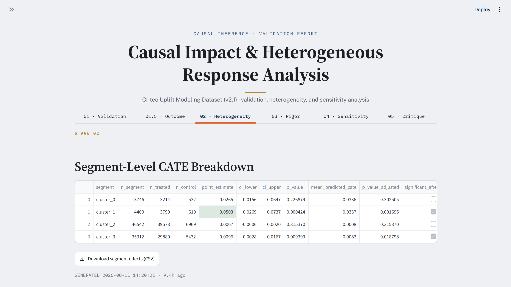
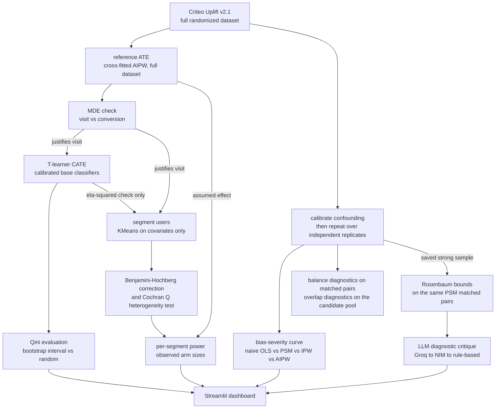

# Causal Impact & Heterogeneous Response Analysis

A causal inference pipeline on randomized ad-exposure data that answers two questions: what is the overall impact, and which audiences responded. Each estimator is benchmarked against a covariate-adjusted full-data reference effect, and each segment result is tested for significance and for genuine differences between segments.

## Preview

<p align="center">
  
</p>

> Additional screenshots live in [`assets/`](assets/).

## What this is

Given the Criteo Uplift dataset, the pipeline:

1. **Validates the method first.** Subsamples are confounded in a controlled way, then naive OLS, PSM, IPW, and AIPW are tested on recovering the reference effect. Independent replicates separate estimator bias from sampling noise.
2. **Justifies the outcome.** An MDE calculation at the real segment-analysis arm sizes selects `visit` over `conversion`.
3. **Finds who responds differently.** A CATE model fit on clean randomized data is evaluated against random targeting with a bootstrap interval. Separately, users are clustered into segments, each with a covariate-adjusted effect.
4. **Checks defensibility.** Multiple-testing correction, a direct test of whether segment effects differ, and per-segment power.
5. **Stress-tests the result.** Rosenbaum bounds show how much unmeasured confounding would overturn the matched-pairs conclusion.

Every run writes to `data/processed/` or the run database, and the dashboard reads from there. Runs are seeded from `src/config.py`, so reruns on the same data reproduce the same numbers.

## Dataset

**[Criteo Uplift Modeling Dataset, v2.1](https://huggingface.co/datasets/criteo/criteo-uplift)** (Diemert et al., 2018): 13,979,592 rows from a randomized ad experiment, no registration needed.

| Column | Type | Description |
|---|---|---|
| `f0` to `f11` | float | 12 anonymized covariates |
| `treatment` | binary | 1 = treated, 0 = control |
| `exposure` | binary | effective exposure flag (loaded and validated, not analyzed) |
| `visit` | binary | base rate 4.70% |
| `conversion` | binary | base rate 0.29% |

Analyses use `treatment`, so effects are effects of assignment, not of effective exposure.

Loading tries `datasets.load_dataset`, then `sklift.datasets.fetch_criteo`. `DataIntegrityError` is raised on a wrong row count, missing or extra columns, treated share outside 0.85 +/- 0.005, visit rate outside 0.0470 +/- 0.001, or conversion rate outside 0.0029 +/- 0.0002.

**Reference effect.** Covariate imbalance in Criteo is small (largest standardized difference 0.049, out-of-fold propensity AUC 0.509), yet the raw difference in means still overstates the effect. The reference is therefore a cross-fitted AIPW estimate on all rows:

- `visit` ATE 0.00715 (95% CI [0.00689, 0.00740]); raw difference 0.01034, Hajek IPW 0.00780. Control rate 3.82%.
- `conversion` ATE 0.00097; raw difference 0.00115. Control rate 0.194%.

### Why `visit`, not `conversion`

Segment analysis uses a 30% holdout of a 500,000-row sample: 150,000 rows, 22,500 control and 127,500 treated. The small control arm limits sensitivity, so the MDE uses these arm sizes, not balanced arms.

| Outcome | Control rate | Absolute MDE | Relative MDE |
|---|---|---|---|
| `visit` | 3.82% | 0.00398 | 10.4% |
| `conversion` | 0.194% | 0.00099 | 51.2% |

The `visit` effect is about 19% of its control rate, 1.8 times its MDE. The `conversion` effect (0.00097) sits at its MDE (0.00099), so per-segment conversion estimates would be unreliable. **Sections 2 and 3 therefore use `visit`**; `conversion` appears only as a reference ATE in Section 1. Detecting the `visit` effect at 80% power needs 7,222 control units; 22,500 are available.

## Pipeline


```mermaid
flowchart TD
    raw[Criteo Uplift v2.1\nfull randomized dataset] --> gt[reference ATE\ncross-fitted AIPW, full dataset]
    raw --> induce[calibrate confounding\nthen repeat over independent replicates]
    induce --> curve[bias-severity curve\nnaive OLS vs PSM vs IPW vs AIPW]
    induce --> balance[balance diagnostics on matched pairs\noverlap diagnostics on the candidate pool]

    gt --> mde[MDE check\nvisit vs conversion]
    mde -->|justifies visit| cate[T-learner CATE\ncalibrated base classifiers]
    mde -->|justifies visit| segment[segment users\nKMeans on covariates only]
    cate --> qini[Qini evaluation\nbootstrap interval vs random]
    cate -->|eta-squared check only| segment
    segment --> bh[Benjamini-Hochberg correction\nand Cochran Q heterogeneity test]
    bh --> power[per-segment power\nobserved arm sizes]
    gt -->|assumed effect| power

    induce -->|saved strong sample| rosenbaum[Rosenbaum bounds\non the same PSM matched pairs]

    curve --> dash[Streamlit dashboard]
    qini --> dash
    power --> dash
    rosenbaum --> critique[LLM diagnostic critique\nGroq to NIM to rule-based]
    critique --> dash
```

### Section 1: Validation via self-induced confounding

- **Retention.** Rows are kept by a rule on one covariate X and treatment, holding the retention rate (`keep_fraction`, default 0.5) and X's marginal distribution fixed. Treated rows are kept with probability `lower + (upper - lower) * sigmoid(g2 * X)`; control probabilities are set so the retention rate holds at every X. `g2 = 0` means no confounding. Because X's distribution is unchanged, the full-data reference stays the valid target. The retained sample keeps the baseline imbalance, so naive OLS differs from the reference even at `g2 = 0`.
- **Covariate.** X is the feature most correlated with the outcome; an outcome-irrelevant X cannot bias the naive estimate.
- **Gate.** Requires a significant X-treatment correlation and the reference effect outside the naive estimate's 95% interval on the same retained sample.
- **Calibration.** From `g2 = 0.25` in steps of 0.25 (up to 8 iterations), keep the smallest passing value. Severities: `none` (0), `mild` (g2), `moderate` (2 g2), `strong` (3 g2).
- **Replicates.** Each of `N_REPLICATES` (default 20) draws a fresh 300,000-row subsample and runs every severity and estimator. The logged estimate is the mean; the band is the 2.5th to 97.5th percentile.

All estimators share one cross-fitted propensity (5-fold, clipped to [0.001, 0.999]) and one population trimmed to the propensity range common to both arms.

| Estimator | Method | Estimates |
|---|---|---|
| Naive OLS | Treatment coefficient, no covariates | Raw difference in the trimmed sample |
| PSM | 1:1 without replacement, logit propensity, caliper 0.2 logit SD | Matched treated units only |
| IPW | Hajek-normalized weighting | Retained-sample ATE |
| AIPW | Doubly robust, outcome models cross-fitted (5 folds) | Retained-sample ATE |

With about 85% treated, PSM is capped by the retained control count and, under confounding, targets a different population than the full-sample ATE.

Diagnostics use the first replicate's `strong` sample. Overlap is reported two ways: the share of the candidate pool inside the shared propensity range (lenient, near 100% for most data) and the overlap coefficient, the shared area of the two propensity histograms (1.0 identical, 0.0 disjoint).

### Section 2: Heterogeneity

A **T-learner** (per-arm logistic regression, sigmoid-calibrated, 3-fold) is fit on a clean 500,000-row sample with a treatment-stratified 30% holdout.

- **Qini.** Coefficient with a 200-resample bootstrap interval.
- **Segments.** 4 KMeans clusters on standardized holdout covariates. Each segment gets a cross-fitted AIPW effect with influence-function intervals and z-test p-values; the raw treated-minus-control difference is saved as `unadjusted_estimate`.
- **Separation.** Eta-squared is the share of predicted-CATE variance the clusters capture, flagged below 0.05. Segment effect estimates stay valid when it is low.

### Section 3: Statistical rigor

- **Benjamini-Hochberg** corrects the per-segment "effect differs from zero" tests. Significance is not heterogeneity.
- **Cochran Q** (with I-squared) tests whether segment effects differ, using the segments' influence-function standard errors.
- **Power** uses observed per-segment arm counts, the holdout control rate, and the reference ATE as the assumed effect. Without `ground_truth.json` it falls back to the median segment effect and records `effect_size_source`.

### Section 4: Sensitivity analysis

**Rosenbaum bounds** run on PSM pairs rebuilt from the saved `strong` sample with the same propensity, trimming, and seed as the estimator comparison. The critical Gamma is solved exactly (alpha 0.05, up to 10); the bounds table uses a 0.1 grid. If the effect is not significant at Gamma = 1, no sensitivity conclusion applies. Critical Gamma below 1.5 is fragile, below 3 moderate, otherwise robust. Few discordant pairs force a low critical Gamma, so read it alongside the discordant-pair count.

### Section 5: LLM critique

The only LLM step. It reads the balance table, overlap statistics, and Rosenbaum result, and flags likely assumption violations in 3 to 5 bullets. Order: **Groq**, **NVIDIA NIM**, then a rule-based critique driven by the overlap coefficient. Truncated or empty completions count as failures. The LLM interprets diagnostics and cannot change any result.

## Results

Single run: seed 42, 20 replicates, `f9` as the confounder. Reference `visit` ATE: 0.00715 (95% CI [0.00689, 0.00740]). The raw difference (0.01034) overstates it by 45%; IPW gives 0.00780.

**Estimator bias against the reference**

| Estimator | none | mild | moderate | strong |
|---|---|---|---|---|
| Naive OLS | +44% | +215% | +342% | +417% |
| PSM | -5% | -23% | -36% | -43% |
| IPW | +5% | +8% | +24% | +47% |
| AIPW | -3% | -7% | -16% | -36% |

IPW and AIPW stay within 8% through `mild`; PSM does not (-23%), partly because it targets a different population. No estimator recovers the reference at `strong`. IPW and AIPW drift in opposite directions (roughly 3 to 5 standard errors at `moderate` and `strong`); the cause is unresolved. Matching on the `strong` sample cut the largest standardized difference from 0.387 to 0.023 (23,294 pairs, 18.4% of treated, overlap coefficient 0.886).

**Heterogeneity.** The T-learner's Qini coefficient is 0.0565 (95% CI [0.0301, 0.0854]), better than random targeting. Segments on the 150,000-row holdout, with AIPW-adjusted effects:

| Segment | Share | Effect | 95% CI | BH p | Raw difference |
|---|---|---|---|---|---|
| cluster_0 | 4.8% | 0.0368 | [0.0203, 0.0534] | 5e-05 | 0.0585 |
| cluster_1 | 51.7% | 0.0001 | [-0.0009, 0.0012] | 0.79 | 0.0002 |
| cluster_2 | 4.1% | 0.0233 | [-0.0055, 0.0520] | 0.15 | 0.0445 |
| cluster_3 | 39.4% | 0.0065 | [0.0015, 0.0116] | 0.023 | 0.0100 |

Effects differ across segments (Cochran Q 26.9, p = 6e-06, I-squared 89%), and the clusters track predicted CATE (eta-squared 0.158). `cluster_2` is inconclusive with only 932 control units. Per-segment power uses one base rate for all segments, so treat it as rough.

**Sensitivity.** Of 23,294 matched pairs, 714 are discordant, and the critical Gamma is 1.12 (fragile). PSM at `strong` sits 43% below the reference, so this speaks to whether an effect exists, not its size.

<p align="center">
  
</p>

**LLM critique.** The Groq critique found no residual imbalance after matching and flagged the result as sensitive to hidden bias.

## Tech stack

| Layer | Choice |
|---|---|
| Compute | Local CPU; full dataset for the reference effect, subsampled for CATE and estimator work |
| Database | Supabase, with local SQLite fallback merged on read |
| Logging | Logfire, with console fallback |
| Dashboard | Streamlit (`>=1.50`, for the `width` argument on `st.pyplot`, `st.dataframe`, `st.button`) |
| LLM | Groq `openai/gpt-oss-120b`, NVIDIA NIM `mistralai/mistral-nemotron`, then rule-based |

## Validity checks

- **Adjusted reference.** The benchmark is a cross-fitted AIPW estimate, since the raw difference in means is biased even in Criteo itself.
- **One propensity everywhere.** Estimators, diagnostics, and Rosenbaum share one cross-fitted propensity and one trimmed population, naive OLS included.
- **True 1:1 matching.** Matched controls leave the pool; diagnostics count distinct control rows by identity, since Criteo covariates are bucketed and rows share values.
- **Segments validated twice.** Eta-squared checks that clusters track predicted CATE; Cochran Q checks that effects differ.
- **No silent row loss.** `severity_label` is required, failed remote writes fall back to SQLite, and reads keep the newest row per key.
- **Loud calibration failure.** `calibrate_confounding` returns `converged=False`; notebook 1 raises on it.

## Project Structure

```
causal-inference-lab/
├── data/                          # dataset cache and generated artifacts (gitignored)
├── assets/                        # dashboard screenshots and the Rosenbaum plot used in this README
│
├── src/
│   ├── config.py                  # shared constants: seed, sample sizes, replicates, features
│   ├── utils/
│   │   ├── data_loader.py         # HF load, sklift fallback, integrity check
│   │   ├── power_analysis.py      # MDE, power curves, per-segment power
│   │   ├── bootstrap.py           # bootstrap CIs and analytic large-n CI
│   │   ├── db.py                  # Supabase run logging with local SQLite fallback
│   │   └── logging_config.py      # Logfire structured logging with console fallback
│   │
│   ├── validation/                # Section 1
│   │   ├── confounding.py         # retention rule, gate, calibration, dose-response
│   │   ├── ground_truth.py        # reference effect: cross-fitted AIPW on the full dataset
│   │   ├── estimators.py          # naive OLS, PSM, IPW, AIPW, propensity, trimming
│   │   └── diagnostics.py         # balance, overlap, overlap coefficient
│   │
│   ├── heterogeneity/             # Sections 2 and 3
│   │   ├── cate.py                # T-learner
│   │   ├── segmentation.py        # clustering, quantile splits, raw and adjusted segment effects, Cochran Q
│   │   └── evaluation.py          # Qini with bootstrap interval, Benjamini-Hochberg
│   │
│   ├── sensitivity/               # Section 4
│   │   └── rosenbaum.py           # bounds, exact critical Gamma, classification
│   │
│   └── llm_critique/              # Section 5
│       └── critique.py            # the one bounded LLM diagnostic step
│
├── notebooks/
│   ├── 01_validation.ipynb        # Sections 1 and 1.5
│   ├── 02_heterogeneity.ipynb     # Sections 2 and 3
│   └── 03_sensitivity.ipynb       # Sections 4 and 5
│
├── dashboard/app.py               # Streamlit dashboard (reads db.py and data/processed/ artifacts)
├── .streamlit/config.toml         # dashboard light theme
│
├── tests/
│
├── .env.example
├── .gitignore
├── requirements.txt
└── README.md
```

## Getting started

1. **Install** (on Windows, activate with `venv\Scripts\activate`)

   ```bash
   git clone https://github.com/abhinavharbola/causal-inference-lab.git
   cd causal-inference-lab
   python -m venv venv && source venv/bin/activate
   pip install -r requirements.txt
   cp .env.example .env
   ```

   On Debian/Ubuntu, installing `supabase` can fail on a system `PyJWT` ("RECORD file not found"). If so, run `pip install supabase --ignore-installed PyJWT`.

2. **API keys.** All optional; each has a local fallback.

   | Variable | Used by | If unset |
   |---|---|---|
   | `GROQ_API_KEY` | LLM critique (primary) | NVIDIA NIM, then rule-based |
   | `NVIDIA_NIM_API_KEY` | LLM critique (fallback) | Rule-based |
   | `SUPABASE_URL` / `SUPABASE_KEY` | Run logging | `data/local_runs.db` |
   | `LOGFIRE_TOKEN` | Structured logging | Console logging |

3. **Database.** SQLite needs no setup. For Supabase, create the table first; the app never creates it:

   ```sql
   create table estimation_runs (
       id bigint generated always as identity primary key,
       method text not null,
       severity_label text not null,
       g2 double precision,
       config text,
       point_estimate double precision,
       ci_lower double precision,
       ci_upper double precision,
       balance_stats text,
       created_at text not null,
       unique (method, severity_label)
   );
   ```

   The unique constraint lets the upsert overwrite a rerun instead of duplicating it.

## Running it

```bash
jupyter notebook
```

Run the notebooks in order. They orchestrate `src/` and also hold some pipeline logic (reference effect, replicate loop, run logging, power-input selection). Settings live in `src/config.py`; lower `N_REPLICATES` for a faster pass. Notebooks 1 and 2 load all 13.98M rows, so budget several GB of RAM.

| Notebook | Writes |
|---|---|
| `01_validation` | `ground_truth.json`, `balance_table.csv`, `match_diagnostics.json`, `data/interim/confounded_strong_with_propensity.parquet`, logged estimator runs |
| `02_heterogeneity` | `qini_curve.json`, `segment_effects.csv`, `segment_separation.json`, `segment_heterogeneity.json`, `segment_power.csv` |
| `03_sensitivity` | `rosenbaum_bounds.csv`, `rosenbaum_critical.json`, `rosenbaum_bounds.png`, `critique.json` |

Files go to `data/processed/` except the parquet, which notebook 3 needs from notebook 1.

```bash
streamlit run dashboard/app.py
```

Six tabs: validation, outcome MDE, heterogeneity, rigor, sensitivity, critique. The dashboard reads saved outputs and recomputes only the MDE calculator, which opens with the notebook 1 values. A missing output names the notebook to run. Database reads are cached for 30 seconds or until "Refresh data" is clicked.

```bash
pytest tests/ -v
```

Tests cover retention, the gate, calibration, cross-fitting, matching, IPW, critical Gamma, overlap, power, database merge and upsert, segment heterogeneity, reference-effect estimation, and adjusted segment effects. Notebook logic, the data loader, the T-learner, and the dashboard are untested.

## Known limitations

- **Benchmark.** The reference is AIPW, which assumes ignorability given the 12 covariates. AIPW (0.00715) and IPW (0.00780) differ by more than the reference interval, so the true adjusted effect is only pinned to about 0.0071 to 0.0078. Under strong confounding IPW overshoots while AIPW and PSM undershoot; the cause is not isolated.
- **Bias curves.** They are specific to the covariate, retention rule, and replicate count. The band is subsampling variability, not a confidence interval, and the gate is a screen that can pass by chance.
- **PSM.** Matching without replacement is capped by the retained control count and skews toward values where controls are plentiful.
- **Heterogeneity inference is approximate.** Cochran Q is a large-sample approximation. Segment adjustment covers only the 12 covariates. Power applies one base rate to every segment, so per-segment power is rough. Qini and its interval are unadjusted, with the effect of that unmeasured. Segments ignore CATE.
- **Rosenbaum.** PSM only, conservative with few discordant pairs, and one-sided: a harmful effect appears as not significant.
- **Unused code.** `run_estimator_comparison_with_ci` and `compute_segment_effects` are not called by the notebooks.