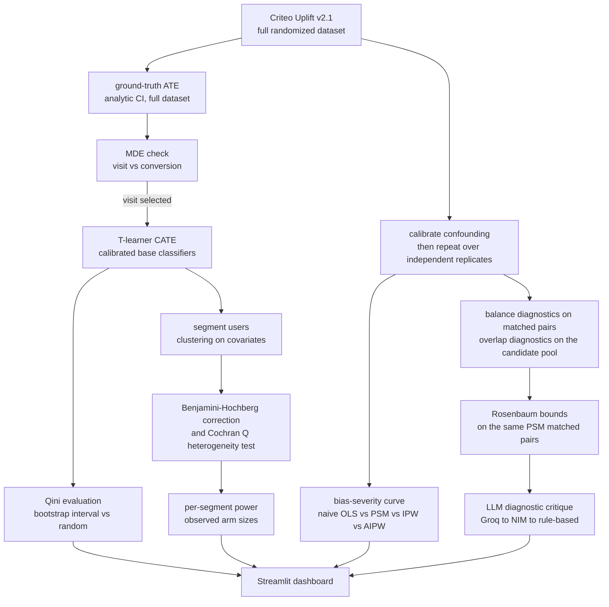

# Causal Impact & Heterogeneous Response Analysis

A causal inference pipeline that turns randomized ad-exposure data into two validated answers: overall impact, and which audiences responded. Each estimator is benchmarked against a known ground truth, and each segment result is tested for significance and for whether segments genuinely differ.

Free-tier only: no paid APIs, no GPU, no local model weights beyond scikit-learn. Runs end to end on a 16GB CPU laptop.

## Preview

<p align="center">
  
</p>

> Additional screenshots live in [`assets/`](assets/). They are static images and are not regenerated by the notebooks.

## What this is

Given the Criteo Uplift dataset, the pipeline:

1. **Validates the method first.** Subsamples are confounded in a controlled way, then naive OLS, PSM, IPW, and AIPW are tested on whether they recover the known ground-truth effect. Independent replicates separate estimator bias from sampling noise.
2. **Justifies the outcome.** An MDE calculation at the real arm sizes of the segment analysis decides between `visit` and `conversion`.
3. **Finds who responds differently.** A CATE model fit on clean randomized data is evaluated against random targeting with a bootstrap interval, then used to segment users.
4. **Checks the finding is defensible.** Multiple-testing correction, a direct test of whether segment effects differ, and per-segment power.
5. **Stress-tests the result.** Rosenbaum bounds show how much unmeasured confounding would overturn the matched-pairs conclusion.

The repository ships code, not results: every run writes its numbers to `data/processed/` or the run database, and the dashboard displays them. Nothing in this README depends on a particular run.

## Dataset

**[Criteo Uplift Modeling Dataset, v2.1](https://huggingface.co/datasets/criteo/criteo-uplift)** (Diemert et al., 2018): 13,979,592 rows from a randomized ad-exposure experiment. v2.1 adds `exposure`. No registration needed.

| Column | Type | Description |
|---|---|---|
| `f0` to `f11` | float | 12 anonymized dense covariates |
| `treatment` | binary | 1 = treated, 0 = control |
| `exposure` | binary | effective exposure flag (v2.1 addition) |
| `visit` | binary | overall base rate 4.70% |
| `conversion` | binary | overall base rate 0.29% |

Loaded via `datasets.load_dataset("criteo/criteo-uplift")`, with `sklift.datasets.fetch_criteo(target_col='all', treatment_col='all')` as an automatic fallback. A post-load integrity check **fails loudly** on drift:

| Check | Rule |
|---|---|
| Row count | exactly 13,979,592 |
| Columns | exactly the 16 expected; missing or extra columns both raise |
| Treated share | 0.85 within 0.005 |
| Visit rate | 0.0470 within 0.001 |
| Conversion rate | 0.0029 within 0.0002 |

Full-dataset facts, independent of any subsample: `visit` ATE 0.01034 (95% CI [0.01006, 0.01063]); `conversion` ATE 0.00115; control-arm rates 3.82% (`visit`) and 0.194% (`conversion`).

### Why `visit`, not `conversion`

Segment analysis runs on a 30% holdout of a 500,000-row sample (150,000 rows, about 85% treated). The MDE uses those arm sizes and control-arm base rates, because the small control arm is the binding constraint; a balanced-arms calculation would overstate sensitivity.

| Outcome | Control rate | Control / treated units | Absolute MDE | Relative MDE |
|---|---|---|---|---|
| `visit` | 3.82% | 22,500 / 127,500 | 0.00398 | 10.4% |
| `conversion` | 0.194% | 22,500 / 127,500 | 0.00099 | 51.2% |

The `visit` effect is about 27% of its control rate, well above its MDE. The `conversion` effect is about 59%, barely above its MDE, so per-segment conversion estimates would be unreliable. **`visit` is therefore the outcome for Sections 2 and 3**; `conversion` appears only as a full-dataset ground-truth ATE in Section 1.

Detecting the full-dataset `visit` effect at 80% power needs about 3,570 control units at this ratio, against 22,500 available.

## Pipeline


```mermaid
flowchart TD
    raw[Criteo Uplift v2.1\nfull randomized dataset] --> gt[ground-truth ATE\nanalytic CI, full dataset]
    raw --> induce[calibrate confounding\nthen repeat over independent replicates]
    induce --> curve[bias-severity curve\nnaive OLS vs PSM vs IPW vs AIPW]
    induce --> balance[balance diagnostics on matched pairs\noverlap diagnostics on the candidate pool]

    gt --> mde[MDE check\nvisit vs conversion]
    mde -->|visit selected| cate[T-learner CATE\ncalibrated base classifiers]
    cate --> qini[Qini evaluation\nbootstrap interval vs random]
    cate --> segment[segment users\nclustering on covariates]
    segment --> bh[Benjamini-Hochberg correction\nand Cochran Q heterogeneity test]
    bh --> power[per-segment power\nobserved arm sizes]

    balance --> rosenbaum[Rosenbaum bounds\non the same PSM matched pairs]

    curve --> dash[Streamlit dashboard]
    qini --> dash
    power --> dash
    rosenbaum --> critique[LLM diagnostic critique\nGroq to NIM to rule-based]
    critique --> dash
```

### Section 1: Validation via self-induced confounding

- **Retention mechanism.** Randomization is broken by keeping rows as a function of one covariate X and treatment, holding fixed the overall retention rate (`keep_fraction`, default 0.5) and the marginal distribution of X. With treated share `p`, treated rows are kept with probability `lower + (upper - lower) * sigmoid(g2 * X)`; control rows get whatever probability keeps `p * treated_prob + (1 - p) * control_prob = keep_fraction` at every X. `g2 = 0` means no confounding. Because X's distribution is unchanged, the full-data ATE stays the right target for the ATE estimators even when effects vary with X.
- **Gate.** X is the feature most correlated with the outcome. The gate requires a significant X-treatment correlation in the retained sample and the ground-truth ATE outside the 95% interval of the naive estimate computed on that same sample. Comparing against the full-data interval (about +/-0.0003) would pass on sampling noise alone.
- **Calibration.** Starts at `g2 = 0.25`, steps by 0.25, keeps the smallest `g2` that passes, and raises if none passes within `max_iters`. Severities: `none` (0), `mild` (g2), `moderate` (2 x g2), `strong` (3 x g2).
- **Replicates.** Each of `N_REPLICATES` (default 20) draws a fresh 300,000-row subsample, applies every severity, and runs all four estimators. The logged estimate is the replicate mean; the band is the 2.5th to 97.5th percentile of replicate estimates.

| Estimator | Population it estimates |
|---|---|
| Naive OLS | Raw treated-minus-control difference in the trimmed retained sample |
| IPW, AIPW | Average treatment effect over the retained sample, which matches the full-data ATE in expectation by the retention design |
| PSM | Effect on the matched treated units only (1:1 without replacement) |

With about 85% treated, matched pairs are capped by the retained control count, so most treated units go unmatched. Without confounding the matched treated units are close to a random subset of the treated. Under confounding the control pool runs out first where controls are scarce, so they skew toward values where controls are plentiful, and PSM targets a different population than the full-sample ATE.

- **Diagnostics.** Balance, overlap, and the Section 4 matched pairs come from the first replicate's strong-severity sample, with the same cross-fitted propensity, trimming, and random state as the estimator comparison.
- **Outputs:** `ground_truth.json`, `balance_table.csv`, `match_diagnostics.json`, `data/interim/confounded_strong_with_propensity.parquet`, and one logged run per method and severity.

### Section 1.5: Outcome selection

See [the MDE table above](#why-visit-not-conversion). Notebook 1 computes it from the full-data control rates and expected holdout arm sizes and saves those inputs in `ground_truth.json`, so the dashboard's MDE calculator opens with the same values.

### Section 2: Heterogeneity

A calibrated **T-learner** (two per-arm logistic regression pipelines with sigmoid calibration) is fit on a clean randomized 500,000-row sample with a treatment-stratified 30% holdout. Causal forests are future work.

- **Qini.** Coefficient with a 200-resample bootstrap interval; the dashboard judges the model against random targeting by whether the interval excludes zero.
- **Segments.** 4 KMeans clusters on standardized covariates. Per-segment effects are observed treated-minus-control differences in the holdout (randomized comparisons regardless of how the clusters formed), with 1,000-resample bootstrap intervals.
- **Separation.** `segment_cate_separation` reports eta-squared, the share of predicted-CATE variance the clusters capture. A low value means the clusters do not track what the model learned; it does not invalidate the observed segment effects.
- **Outputs:** `qini_curve.json` (curve downsampled to at most 500 points), `segment_effects.csv`, `segment_separation.json`.

### Section 3: Statistical rigor and corrections

- **Benjamini-Hochberg** corrects the per-segment tests of "effect differs from zero". A significant segment is not evidence of heterogeneity: a segment matching the overall effect is also significant.
- **Cochran Q** (with I-squared) directly tests whether segment effects differ, using each segment's analytic standard error.
- **Power** uses each segment's observed treated and control counts and the holdout's control-arm baseline. The assumed effect is the Section 1 ground-truth ATE (avoiding circularity), with its source saved as `effect_size_source`; it falls back to the median observed segment effect only if `ground_truth.json` is missing. Power is computed for the aggregate effect, so a segment can be both individually significant and underpowered.
- **Outputs:** `segment_heterogeneity.json`, `segment_power.csv`.

### Section 4: Sensitivity analysis

**Rosenbaum bounds** run on the PSM pairs rebuilt with the same cross-fitted propensity, trimming, and random state as the estimator comparison, so they describe the sample PSM used. The critical Gamma is solved exactly by root finding on the worst-case p-value (alpha 0.05, up to Gamma 10); the bounds table uses a 0.1 grid for plotting.

The result records whether the effect is significant at Gamma = 1; if not, no sensitivity conclusion applies, and the dashboard and critique say so. One shared rule classifies the outcome: critical Gamma below 1.5 is fragile, below 3 moderate, otherwise robust (including never crossed). With few discordant pairs, critical Gamma is low regardless of covariate quality, so read it with the discordant-pair count.

**Outputs:** `rosenbaum_bounds.csv`, `rosenbaum_critical.json`, `rosenbaum_bounds.png`.

### Section 5: The one (and only) LLM step

A critique over the balance table, overlap statistics, and the Rosenbaum result. **Groq** is primary, **NVIDIA NIM** the fallback, and a deterministic rule-based critique runs if both fail. A truncated or empty completion counts as a failure. The prompt states that Gamma is an odds ratio and must not be converted to a percentage. The LLM is used nowhere else.

Overlap is reported two ways: the share of the candidate pool inside the propensity range shared by both arms (lenient, near 100% for almost any data), and the overlap coefficient, the shared area of the two propensity histograms (1.0 identical, 0.0 disjoint), which the rule-based critique uses to flag weak overlap.

**Output:** `critique.json`.

## Tech stack

| Layer | Choice |
|---|---|
| Compute | Local CPU only, subsampled for CATE and estimator work |
| Core libraries | `pandas`, `numpy`, `pyarrow`, `scikit-learn`, `statsmodels`, `scipy`, `scikit-uplift`, `sortedcontainers` |
| Database | Supabase (primary), local SQLite (automatic fallback, merged on read) |
| Logging | Logfire (structured, configured once per process), console fallback |
| Dashboard | Streamlit with custom CSS and a pinned `.streamlit/config.toml` theme; no separate stylesheet or build step |
| LLM | Groq (`openai/gpt-oss-120b`), then NVIDIA NIM (`mistralai/mistral-nemotron`), then rule-based; free tier |

The dashboard uses the `width` argument on `st.pyplot`, `st.dataframe`, and `st.button`, so it needs a recent Streamlit; `requirements.txt` pins `streamlit>=1.50`.

## Methods

| Section | Method | Library | Role |
|---|---|---|---|
| 1 | Naive OLS | `statsmodels` | Baseline with no confounder adjustment |
| 1 | Propensity score matching | `scikit-learn`, `sortedcontainers` | 1:1 without replacement, nearest neighbor on the logit of the propensity score, caliper of 0.2 logit standard deviations, random matching order |
| 1 | IPW | `scikit-learn` | Hajek-normalized inverse probability weighting |
| 1 | AIPW | `scikit-learn` | Doubly robust. Propensity cross-fitted once and shared with IPW and PSM; the two outcome models are also cross-fitted (`StratifiedKFold`, 5 folds) |
| 1 | Common-support trim | `pandas` | Keeps rows inside the propensity range shared by both arms; propensities clipped to [0.001, 0.999] |
| 2 | T-learner CATE | `scikit-learn` | Two calibrated per-arm outcome models; their difference is the CATE |
| 2 | Qini coefficient | `scikit-uplift` | Ranking quality versus random targeting, with a bootstrap interval |
| 3 | Segment / CATE separation | `scipy` | One-way ANOVA and eta-squared of predicted CATE across segments |
| 3 | Benjamini-Hochberg | `statsmodels` | False discovery control across segment tests |
| 3 | Effect heterogeneity | `scipy` | Cochran Q and I-squared across segment effects |
| 4 | Rosenbaum bounds | `scipy` | Sensitivity of the matched-pairs conclusion to an unmeasured confounder |

## Guardrails

- **Calibration fails loudly.** If no `g2` passes within `max_iters`, `converged` is False and the notebook raises; there is no default severity.
- **Noise-aware gate.** Ground truth is compared with the retained sample's own naive interval, so unconfounded data rarely passes.
- **Estimand preserved.** Constant marginal retention across X keeps the full-data ATE the right target for IPW and AIPW.
- **True 1:1 matching.** Matched controls leave the pool, and diagnostics count distinct control rows by identity, since Criteo covariates are bucketed and distinct rows often share values.
- **One propensity everywhere.** Estimators, diagnostics, and Rosenbaum bounds share one cross-fitted propensity and one trimmed population, naive OLS included.
- **Cross-fitted nuisance models.** `run_estimator_comparison` defaults to `cross_fit=True`, `n_splits=5`; `cross_fit=False` is available for comparison.
- **Segments validated twice.** Eta-squared checks that clusters track predicted CATE; Cochran Q checks that effects genuinely differ.
- **Explicit power inputs.** The assumed effect and its source are saved with the power table.
- **Enforced data integrity.** Exact row count and columns and tight rate bands, checked on load.
- **No silent row loss.** `severity_label` is required, failed remote writes fall back to SQLite, and reads merge both stores, keeping the newest row per key.
- **LLM cannot change results.** It only interprets existing diagnostics, and truncated or empty output is rejected.

## Project Structure

```
causal-inference-lab/
├── data/                          # dataset cache and generated artifacts (gitignored)
├── assets/                        # dashboard screenshots used in this README
│
├── src/
│   ├── config.py                  # shared constants: seed, sample sizes, replicates, features
│   ├── utils/
│   │   ├── data_loader.py         # HF load, sklift fallback, integrity check
│   │   ├── power_analysis.py      # MDE, power curves, per-segment power
│   │   ├── bootstrap.py           # bootstrap CIs and analytic large-n CI
│   │   ├── db.py                  # Supabase run logging with local SQLite fallback
│   │   └── logging_config.py      # Logfire structured logging with console fallback
│   │
│   ├── validation/                # Section 1
│   │   ├── confounding.py         # retention rule, gate, calibration, dose-response
│   │   ├── estimators.py          # naive OLS, PSM, IPW, AIPW, propensity, trimming
│   │   └── diagnostics.py         # balance, overlap, overlap coefficient
│   │
│   ├── heterogeneity/             # Sections 2 and 3
│   │   ├── cate.py                # T-learner
│   │   ├── segmentation.py        # clustering, quantile splits, segment effects, Cochran Q
│   │   └── evaluation.py          # Qini with bootstrap interval, Benjamini-Hochberg
│   │
│   ├── sensitivity/               # Section 4
│   │   └── rosenbaum.py           # bounds, exact critical Gamma, classification
│   │
│   └── llm_critique/
│       └── critique.py            # the one bounded LLM diagnostic step
│
├── notebooks/
│   ├── 01_validation.ipynb        # Sections 1 and 1.5
│   ├── 02_heterogeneity.ipynb     # Sections 2 and 3
│   └── 03_sensitivity.ipynb       # Section 4
│
├── dashboard/app.py               # Streamlit dashboard (reads db.py and data/processed/ artifacts)
├── .streamlit/config.toml         # dashboard light theme
│
├── tests/
│
├── .env.example
├── .gitignore
├── requirements.txt
└── README.md
```

## Getting started

1. **Install**
   ```bash
   git clone https://github.com/abhinavharbola/causal-inference-lab.git
   cd causal-inference-lab
   python -m venv venv && source venv/bin/activate    # venv\Scripts\activate on Windows
   pip install -r requirements.txt
   cp .env.example .env    # fill in whichever keys you use; all are optional
   ```

   > **Known install gotcha (Debian/Ubuntu):** installing `supabase` can fail to upgrade a system-installed `PyJWT` ("Cannot uninstall PyJWT ... RECORD file not found"). If so, run `pip install supabase --ignore-installed PyJWT`.

2. **API keys.** All optional; each has a local fallback, so the pipeline runs end to end with none set.

   | Variable | Used by | If unset |
   |---|---|---|
   | `GROQ_API_KEY` | LLM critique (primary) | Falls back to NVIDIA NIM, then rule-based |
   | `NVIDIA_NIM_API_KEY` | LLM critique (fallback) | Falls back to rule-based |
   | `SUPABASE_URL` / `SUPABASE_KEY` | Run logging | Falls back to `data/local_runs.db` |
   | `LOGFIRE_TOKEN` | Structured logging | Falls back to console logging |

3. **Database.** The SQLite fallback needs no setup. For Supabase, create the table first (the app never creates it):

   ```sql
   create table estimation_runs (
       id bigint generated always as identity primary key,
       method text not null,
       severity_label text not null,
       g2 double precision,
       config text,
       point_estimate double precision,
       ci_lower double precision,
       ci_upper double precision,
       balance_stats text,
       created_at text not null,
       unique (method, severity_label)
   );
   ```

   Run it in the Supabase SQL editor before setting `SUPABASE_URL` and `SUPABASE_KEY`. The `unique (method, severity_label)` constraint makes `log_estimation_run`'s upsert overwrite a rerun instead of duplicating it, and requires `severity_label` to be non-null.

## Running it

```bash
jupyter notebook
```

Run the three notebooks in order, from the project root or `notebooks/` (paths resolve against the project root). Each is a thin wrapper over `src/`. Shared settings (seed, sample sizes, replicate count, cluster count) live in `src/config.py`.

1. `01_validation.ipynb` (Sections 1, 1.5): saves `ground_truth.json`, `balance_table.csv`, and `match_diagnostics.json` to `data/processed/` and `confounded_strong_with_propensity.parquet` to `data/interim/`, and logs the aggregated estimator runs. Runtime scales with `N_REPLICATES` (default 20); lower it in `src/config.py` for a faster pass.
2. `02_heterogeneity.ipynb` (Sections 2, 3): saves `qini_curve.json`, `segment_effects.csv`, `segment_power.csv`, `segment_separation.json`, and `segment_heterogeneity.json`.
3. `03_sensitivity.ipynb` (Section 4): loads notebook 1's saved sample and saves `rosenbaum_bounds.csv`, `rosenbaum_critical.json`, `rosenbaum_bounds.png`, and `critique.json`.

Then view everything together:

```bash
streamlit run dashboard/app.py
```

The dashboard only visualizes; it recomputes nothing. It reads logged runs and saved artifacts across six tabs (validation, outcome MDE, heterogeneity, rigor, sensitivity, critique), and the sidebar shows which of eight pipeline outputs exist (seven saved files plus the logged runs). A missing artifact names the notebook to run. Files refresh when they change; database reads are cached for 30 seconds or until you click "Refresh data".

Run the tests with:

```bash
pytest tests/ -v
```

100 tests: `test_confounding.py` (15), `test_critique.py` (8), `test_db.py` (6), `test_diagnostics.py` (11), `test_estimators.py` (24), `test_evaluation.py` (4), `test_power_analysis.py` (12), `test_rosenbaum.py` (8), and `test_segmentation.py` (12). Coverage: the retention design (marginal X preserved, naive bias growing with g2), gate false-pass rate, calibration, cross-fitting (an overfit-prone dataset shows in-sample AUC far above cross-fitted AUC), matching (logit caliper, 1:1 uniqueness, diagnostics pairs equal the PSM estimator's), IPW normalization, exact critical Gamma, overlap statistics, unequal-arm power, database merge and upsert, and segment heterogeneity.

## Known limitations

- **PSM coverage.** 1:1 matching without replacement is capped by the retained control count, so most treated units go unmatched. Without confounding the matched set is close to a random subset of the treated; under confounding it skews toward covariate values where controls are plentiful, so PSM targets a different population than the full-sample ATE.
- **Design-specific bias curves.** Results depend on the covariate, retention mechanism, and replicate count; the replicate band reflects subsampling variability, not a confidence interval for the mean.
- **Gate false passes.** At `g2 = 0` the gate can pass by chance, at a rate bounded by the 5% level of its correlation test. Calibration is a screen, not proof of confounding.
- **`conversion` is too sparse for segments.** Its relative MDE at segment arm sizes is about 5x that of `visit`.
- **Segment power uses the aggregate effect**, so a segment can be both significant and underpowered. This is intentional, to avoid circularity.
- **Cochran Q is a large-sample approximation** treating segment effects as independent normal estimates: reasonable for disjoint subsets of one randomized holdout, but low-powered for small segments.
- **Rosenbaum covers PSM only** (IPW and AIPW have no matched pairs) and is conservative with few discordant pairs.
- **Rosenbaum is one-sided** (`alternative="greater"`): a harmful matched-pair effect is reported as not significant rather than as a sensitivity result.
- **Bootstrap CIs omit nuisance-model uncertainty.** `run_estimator_comparison_with_ci` fits nuisance models once and bootstraps the resulting scores or pair differences; the replicate pipeline does not use it.
- **Segmentation is not CATE-aware.** KMeans clusters on covariates, so clusters may not track predicted effect variation; eta-squared measures how well they do.
- **Free-tier LLMs.** If both providers fail or return unusable output, the rule-based fallback runs: correct but less nuanced.
- **Screenshots in `assets/` are static** and are not updated by the notebooks.
